# Evolution Strategies at Scale: LLM Fine-Tuning Beyond Reinforcement Learning

Xin Qiu\*,†; Yulu Gan\*,‡; Conor F. Hayes\*; Qiyao Liang‡; Yinggan Xu‡; Roberto Dailey; Elliot Meyerson; Babak Hodjat; and Risto Miikkulainen

\* Equal contribution. † Project lead. ‡ Work completed during an internship at Cognizant AI Lab.

Affiliations: Cognizant AI Lab; Massachusetts Institute of Technology; University of California, Los Angeles; and The University of Texas at Austin. Correspondence: `qiuxin.nju@gmail.com`.

Paper: [arXiv:2509.24372](https://arxiv.org/abs/2509.24372) · [PDF](https://arxiv.org/pdf/2509.24372) · [source code](https://github.com/VsonicV/es-fine-tuning-paper)

> **Conversion note.** This is a manually reviewed Markdown transcription of the 27-page arXiv PDF (revision dated February 2026). The PDF and its LaTeX source were used together: equations, algorithms, tables, captions, links, and section references were reconstructed by hand after an automated first pass. Obvious extraction artifacts were corrected without changing the authors' claims. Figure images were rendered from the paper's vector originals. For linear web reading, the bibliography follows the appendices and Appendix A.* is numbered as Section 7.*. Apparent errors in the source prose and quoted model outputs are retained verbatim rather than silently corrected.

## Abstract

Fine-tuning large language models (LLMs) for downstream tasks is an essential stage of modern AI deployment. Reinforcement learning (RL) has emerged as the dominant fine-tuning paradigm, underpinning many state-of-the-art LLMs. In contrast, evolution strategies (ES) has largely been overlooked due to the widespread belief that it does not scale to modern model sizes. This paper overturns this assumption by demonstrating the first successful application of ES to full-parameter fine-tuning of LLMs at the billion-parameter scale, without dimensionality reduction. ES can indeed search over extremely high-dimensional parameter spaces and outperform established RL implementations across multiple axes, including improved tolerance to long-horizon and delayed rewards, robustness across diverse base LLMs, reduced susceptibility to reward hacking, and improved training stability. These findings suggest that ES is not merely a viable alternative to RL, but a fundamentally different and powerful backpropagation-free post-training paradigm that opens a new direction for LLM fine-tuning beyond current RL-based approaches. The source code is available at <https://github.com/VsonicV/es-fine-tuning-paper>.

<a id="sec:intro"></a>

# 1. Introduction

As the capabilities of large language models (LLMs) have rapidly improved, these systems have been increasingly deployed across scientific and engineering workflows (Touvron et al. 2023; Achiam et al. 2024; AI@Meta 2024; Jiang et al. 2024; A. Liu et al. 2024; Anthropic 2025; Google 2025; Singhal et al. 2023; Wu et al. 2023; Rozière et al. 2024; Romera-Paredes et al. 2024). This widespread deployment has made fine-tuning a standard step for adapting pre-trained models to downstream tasks and aligning behavior with user preferences (Ouyang et al. 2022; Rafailov et al. 2023; Latif and Zhai 2024; Guo et al. 2025b). In practice, reinforcement learning (RL) has become the predominant choice for this fine-tuning stage (Ouyang et al. 2022; Bai et al. 2022; Shao et al. 2024; Guo et al. 2025b, 2025a; Srivastava and Aggarwal 2025). However, several challenges have emerged: First, RL methods incur low sample efficiency and high variance of the gradient estimator when handling long-horizon rewards, which is a common case for LLM fine-tuning with outcome-only rewards (Salimans et al. 2017; Sutton and Barto 2018; Vemula et al. 2019). Proper credit assignment at token level for RL fine-tuning methods is difficult and possibly unhelpful (Zhang et al. 2025; Song et al. 2025; Guo et al. 2025a, 2025a; Uesato et al. 2022; Jia et al. 2025). Second, RL techniques are sensitive to the choice of base LLMs, resulting in inconsistent fine-tuning performance across different models (Gandhi et al. 2025). Third, RL techniques tend to incentivize hacking the reward function, leading to undesirable behaviors (Gao et al. 2023; Denison et al. 2024; Fu et al. 2025). Fourth, RL fine-tuning is often unstable across multiple runs even with the same hyperparameter settings, significantly increasing fine-tuning cost (Choshen et al. 2020; Zhong et al. 2025).

Evolution Strategies (ES), a class of population-based zeroth-order optimization algorithms, is a possible alternative. ES has several advantages over RL in traditional control and gaming problems: it parallelizes naturally, tolerates long-horizon rewards, promotes broad exploration, avoids expensive backpropagation, and remains robust across hyperparameter settings (Salimans et al. 2017; Chrabaszcz et al. 2018; Conti et al. 2018). However, ES remains relatively underexplored in LLM fine-tuning settings. Standard ES directly optimizes in the full parameter space, which in prior applications typically contained no more than a few million parameters (Salimans et al. 2017; Zhang et al. 2017; Lehman et al. 2018; Lorenc and Neruda 2025). It was assumed that for very large models, exploration in parameter space is significantly more difficult and sample-inefficient than exploration in action space (Vemula et al. 2019). Modern LLMs typically contain billions of parameters, which makes direct ES optimization appear infeasible. Existing workarounds include restricting ES to the final layer of the base model (Toledano-López et al. 2022), applying ES to low-dimensional adapters (Jin et al. 2024), and performing evolutionary search in action space, analogous to standard RL (Huang et al. 2025). Directly searching in the full parameter space of LLMs (without dimensionality reduction) has remained a challenge.

This paper is aimed at meeting this challenge. For the first time, ES is scaled to multi-billion-parameter search spaces through direct optimization of the full parameter space of LLMs during fine-tuning. The approach is based on a memory-efficient implementation of an algorithmically simplified ES variant, with support for parallelization across GPUs. Performance is compared with state-of-the-art (SOTA) RL methods in fine-tuning various LLMs in several reasoning benchmark tasks, and behavioral differences from RL are analyzed in terms of fine-tuning for conciseness. Furthermore, ES fine-tuning is successfully applied to solve two puzzle problems that are challenging for base LLMs.

ES was found able to search directly over billions of parameters without dimensionality reduction while achieving strong fine-tuning performance relative to RL in multiple aspects: (1) *ES only needs response-level rewards*, making it a perfect fit for fine-tuning on reasoning tasks that have only sparse long-horizon outcome rewards. In particular, ES obtained significantly better fine-tuned models than RL in the Countdown task with such rewards. (2) *ES is able to find good solutions in large space with small populations*, e.g. just 30 in the multi-billion-parameter space in this paper. As a comparison, previous ES implementations (Salimans et al. 2017; Zhang et al. 2017; Lehman et al. 2018; Lorenc and Neruda 2025) utilized a population size of 10,000 or more with much smaller models (i.e. millions of parameters or less). The current extremely small population size thus makes the approach feasible even without extensive compute. (3) *ES is more robust* than RL across different LLMs. While RL fine-tuning failed on some LLMs, ES provided good fine-tuning for all of them. ES benefits from its exploration in parameter space, making it less sensitive to initial states of the LLMs. (4) *ES consistently maintains reasonable behaviors* during fine-tuning, in contrast to RL that tends to hack the reward function if no other penalty is added. The main reason is that ES optimizes a solution distribution (Lehman et al. 2018), which is more difficult to hack, while RL optimizes a single solution. (5) *ES’s behavior is more consistent* than RL’s across different runs. This property can significantly reduce expected cost of fine-tuning. (6) *Fine-tuning with ES only requires inference*, and therefore no gradient calculations are needed. A significant amount of GPU memory can therefore be saved.

Thus, this study establishes a critical first milestone in demonstrating that ES can serve as a viable and powerful post-training paradigm for LLMs. The results reveal a surprising and counterintuitive finding that ES remains effective when scaled to models with billions of parameters, directly challenging the long-held assumption that such methods are inherently unscalable. These findings not only motivate further scaling to even larger LLMs, but fundamentally expand the design space of post-training algorithms. By operating directly in parameter space without reliance on gradients or intermediate supervision, ES enables new forms of outcome-only optimization, robust exploration over high-dimensional parameter landscapes, and naturally distributed large-scale fine-tuning. Taken together, this paper positions ES as a foundational alternative to gradient-based RL and opens a new direction for scalable, stable, and general LLM post-training.

# 2. Related Work

The background on Evolution Strategies and evolutionary optimization of LLMs is first reviewed, followed by state-of-the-art RL fine-tuning and parameter-space exploration.

**Traditional ES:** Evolution Strategies (ES, Rechenberg 1973; Schwefel 1977) are a class of evolutionary algorithms (EAs) for solving numerical optimization problems. The main idea is to sample a population of solutions through perturbations, then recombine the perturbed solutions based on their fitness values to form the population for the next generation. This process repeats until a termination condition is triggered, e.g., the maximum number of generations is reached. Among the different variants of ES, CMA-ES (Hansen and Ostermeier 2001), which utilizes a multivariate Gaussian distribution with full covariance matrix to sample the population, and natural ES (Wierstra et al. 2008, 2014), which uses natural gradient to guide the search, are two popular methods for traditional optimization problems. Although ES has long been used to evolve parameters of neural networks (NNs), (Igel 2003), Salimans et al. (2017) were the first to scale the approach up to deep learning networks. Comparable performance to RL methods in control and gaming environments was observed, and several unique advantages of ES highlighted. This seminal work paved the way for several follow-up studies. Zhang et al. (2017) used ES to optimize a convolutional NN with around three million parameters. They found that with a large enough population size, ES can approximate the performance of traditional stochastic gradient descent (SGD). Lehman et al. (2018) further optimized a NN comprising nearly 167,000 parameters with both ES and a finite-difference (FD) gradient estimator. Because ES optimizes the average reward for the entire population, whereas FD optimizes the reward for a single solution, it obtained models that were more robust to parameter perturbations. Lorenc and Neruda (2025) applied ES to optimize decision transformers in RL environments, and observed promising results for model sizes up to around 2.5 million parameters. In a related study, another traditional EA, namely genetic algorithm (GA) with mutations only, was extended to a high-dimensional space (Such et al. 2017). Encouraging results were observed in different types of models with up to around four million parameters (Such et al. 2017; Risi and Stanley 2019). However, although these studies were promising, the scale of these implementations was still significantly less than the size of current LLMs.

**Evolution+LLMs:** Synergies between Evolutionary Algorithms (EAs) and LLMs have received increasing attention in recent years (Wang et al. 2025; Wu et al. 2025). Popular research directions include EAs for prompt optimization (Sun, Shao, et al. 2022; Sun, He, et al. 2022; Zhao et al. 2023; Guo et al. 2024), utilizing LLMs as evolutionary operators (Meyerson et al. 2024; Lehman et al. 2024; Romera-Paredes et al. 2024; Novikov et al. 2025), and merging LLMs through evolution (Du et al. 2024; Akiba et al. 2025). Applying EAs to optimize billions of parameters in LLMs is generally perceived to be intractable, but a few studies have been successful at a smaller scale. For example, Toledano-López et al. (2022) fine-tuned the last layer (with 325 parameters) of an mT5-based transformer via CMA-ES. Jin et al. (2024) optimized the low-rank adapter parameters (with dimensionality up to 1600) using CMA-ES and the Fireworks algorithm. Sanchez Carmona et al. (2024) applied a GA to fine-tune around 9.5 million parameters of a transformer encoder, though poorer performance than the traditional Adam optimizer was observed. Huang et al. (2025) proposed a hybrid algorithm that performs exploration in action space instead of parameter space, and it was only used in the final epoch of supervised fine-tuning (SFT). The work in this paper significantly extends this prior research by successfully scaling ES to search in the billions of parameters of LLMs, leading to surprisingly good fine-tuning performance.

**RL for fine-tuning:** Fine-tuning using RL is a critical step during the training of many landmark LLMs (Ouyang et al. 2022; Bai et al. 2022; Shao et al. 2024; Guo et al. 2025b, 2025a). Proximal Policy Optimization (PPO; Schulman et al. 2017) and Group Relative Policy Optimization (GRPO; Shao et al. 2024) are the two predominant methods. PPO introduces a clipped surrogate objective to limit the update scale in each step with respect to the old policy, and it usually works with a value model in an actor-critic manner. GRPO simplifies the pipeline of PPO by replacing the value model with group advantage, which is calculated based on direct evaluations of multiple responses. As discussed in Section [1](#sec:intro), in the context of LLM fine-tuning, these methods struggle with several fundamental limitations, including the dilemma in handling long-horizon reward (Vemula et al. 2019; Salimans et al. 2017; Zhang et al. 2025; Song et al. 2025; Uesato et al. 2022; Jia et al. 2025; Guo et al. 2025a), sensitivity to base LLMs (Gandhi et al. 2025), tendency to hack reward (Gao et al. 2023; Denison et al. 2024; Fu et al. 2025), and instability across runs (Choshen et al. 2020; Zhong et al. 2025). ES inherently avoids these limitations, leading to better fine-tuning performance.

**Parameter-space exploration:** Existing RL fine-tuning methods are overwhelmingly based on action-space exploration. Parameter space exploration has received much less attention, though some such studies do exist (Rückstieß et al. 2008, 2010; Sehnke et al. 2010; Plappert et al. 2018). Although promising performance was observed in problems with sparse rewards, the scale of the tested models was far smaller than that of LLMs. Vemula et al. (2019) performed a theoretical analysis of different exploration strategies, and found that the complexity of the parameter space exploration increased quadratically with the number of parameters, whereas the complexity of action space exploration depended on action dimensionality quadratically and horizon length of the reward quartically. Based on the classical SPSA method (Spall 1992), Malladi et al. (2023) proposed a zeroth-order optimizer MeZO that directly worked in parameter space for fine-tuning LLMs. MeZO significantly reduced memory requirements, but its fine-tuning performance was no better than other baselines. In contrast, the ES implementation in this paper performs exploration in multi-billion-parameter search spaces, and exhibits strong performance across different benchmarks.

# 3. Method

This section introduces the basic algorithmic structure of ES, followed by a detailed description of its implementation for LLM fine-tuning.

## 3.1. Basic ES algorithm

The ES implementation used in this paper is based on a simplified variant of Natural Evolution Strategies (NES) (Wierstra et al. 2008, 2014) and follows the design of OpenAI ES (Salimans et al. 2017), which employs fixed-covariance perturbation noise.

<a id="alg:es-llm_general"></a>

**Algorithm 1 — Basic ES algorithm**

**Inputs:** pretrained LLM parameters $\bm{\theta}_0$; reward function $R(\cdot)$; number of iterations $T$; population size $N$; noise scale $\sigma$; learning rate $\alpha$.

1. For $t = 1, \ldots, T$:
   1. For $n = 1, \ldots, N$:
      1. Sample $\bm{\varepsilon}_n \sim \mathcal{N}(0, \bm{I})$.
      2. Evaluate the perturbed model:
         $$R_n = R\!\left(\bm{\theta}_{t-1} + \sigma\bm{\varepsilon}_n\right).$$
   2. Normalize the rewards $R_n$.
   3. Update the parameters:
      $$\bm{\theta}_t \leftarrow \bm{\theta}_{t-1} + \alpha\frac{1}{N}\sum_{n=1}^{N}R_n\bm{\varepsilon}_n.$$

Given a pretrained LLM with initial parameters $\bm{\theta}_0$ and a target reward function $R(\cdot)$, the task is to fine-tune the parameters so that the reward function is optimized (Algorithm [1](#alg:es-llm_general)). In each iteration, $N$ perturbed models are sampled by adding random Gaussian noise $\bm{\varepsilon}_n$ to their parameters. The noise is i.i.d. in each dimension of the parameter space, and it is scaled by the hyperparameter $\sigma$. The perturbed models are evaluated to obtain their reward scores $R_n$. The final update of the model parameters aggregates the sampled perturbations by weighting them using their normalized reward scores. The standard update equation $\bm{\theta}_{t} \leftarrow \bm{\theta}_{t-1}+ \alpha \cdot \frac{1}{\sigma}\frac{1}{N}\sum_{n=1}^N R_n \bm{\varepsilon}_n$ is simplified to $\bm{\theta}_{t} \leftarrow \bm{\theta}_{t-1}+ \alpha \cdot \frac{1}{N}\sum_{n=1}^N R_n \bm{\varepsilon}_n$ by digesting the term $\frac{1}{\sigma}$ into the learning rate $\alpha$.

To improve scalability, a number of modifications to this basic algorithm were made as detailed in the next section.

## 3.2. Implementation details

The actual implementation of ES for this paper expands on the above algorithm in seven ways (see Appendix [7.1](#app:algorithm) for the detailed pseudocode):

(1) *Noise retrieval with random seeds:* Similar to Salimans et al. (2017; Such et al. 2017), only the random seeds are stored to reduce GPU memory usage. The perturbation noise used during sampling can be retrieved exactly by resetting the random number generator with specific random seeds. (2) *Parallel evaluations:* In each iteration, the perturbed models can be evaluated fully in parallel by assigning a separate random seed to each process. (3) *Layer-level in-place perturbation and restoration:* To reduce the peak GPU memory usage, the model parameters are perturbed in-place layer by layer, with corresponding random seeds archived. After evaluation of the perturbed model, the model parameters are restored by subtracting the same noise perturbations using the archived random seeds. For each evaluation process, apart from the model parameters, the only additional memory needed is to store a tensor the size of a layer temporarily. (4) *Reward normalization:* The rewards of the perturbed models are normalized using $z$-score within each iteration, so that the normalized rewards for each iteration have a mean of 0 and standard deviation of 1. This normalization makes the reward scale consistent across iterations and tasks. (5) *Greedy decoding:* The perturbed models use greedy decoding to generate the responses for reward evaluations. As a result, the perturbed models are evaluated deterministically, so that all performance differences come from the exploration in parameter space instead of action space. (6) *Decomposition of the parameter update:* At the end of each iteration, the aggregated update of model parameters is performed in-place in a decomposed manner, gradually adding up layer by layer and seed by seed, significantly reducing the peak GPU memory needed. (7) *Learning rate digestion:* The standard update equation $\bm{\theta}_{t} \leftarrow \bm{\theta}_{t-1}+ \alpha \cdot \frac{1}{\sigma}\frac{1}{N}\sum_{n=1}^N R_n \bm{\varepsilon}_n$ is simplified to $\bm{\theta}_{t} \leftarrow \bm{\theta}_{t-1}+ \alpha \cdot \frac{1}{N}\sum_{n=1}^N R_n \bm{\varepsilon}_n$ by digesting the term $\frac{1}{\sigma}$ into the learning rate $\alpha$, simplifying the computation and parametric setup.

To highlight the strength of ES, we intentionally remove common algorithmic enhancements explored in OpenAI ES (Salimans et al. 2017). Enhancements like rank transformation of rewards (Wierstra et al. 2014), mirrored sampling (Sehnke et al. 2010), weight decay, and virtual batch normalization (Salimans et al. 2016) are not used in this work. Additionally, we do not utilize more advanced optimizers like Adam (Kingma and Ba 2015). This design choice isolates the core ES algorithm and demonstrates that strong performance can be achieved without auxiliary enhancements. In future work, each individual enhancement can be explored to further improve performance.

# 4. Empirical Studies

This section first compares the fine-tuning performance of ES and RL baselines on a standard reasoning benchmark. After that, behavioral differences between ES and RL are investigated in fine-tuning for conciseness, followed by comparisons to additional state-of-the-art RL baselines on several math reasoning tasks. Finally, ES is applied to solve two challenging puzzle problems.

<a id="sec:exp"></a>

## 4.1. Performance in the Countdown task

Fine-tuning performance was measured in the Countdown task (Gandhi et al. 2024; Pan et al. 2025), a symbolic reasoning benchmark (see Appendix [7.3](#app:countdown_example) for details), showing that ES is accurate and efficient across different kinds and sizes of LLMs, even when the RL approaches are not.

<a id="tab:countdown_main"></a>

**Table 1 — Countdown accuracy (%) across model families, sizes, and fine-tuning algorithms.**

| Base model | Original | PPO-z | GRPO-z (8) | GRPO-z (30) | GRPO-v | Dr.GRPO-v | **ES (ours)** |
|:--|--:|--:|--:|--:|--:|--:|--:|
| Qwen-2.5-0.5B-Instruct | 0.1 | 0.3 | 0.3 | 0.5 | 13.0 | 13.5 | **14.4** |
| Qwen-2.5-1.5B-Instruct | 0.7 | 14.2 | 13.9 | 14.8 | 27.8 | 31.0 | **37.3** |
| Qwen-2.5-3B-Instruct | 10.0 | 20.1 | 30.9 | 32.5 | 37.8 | 43.8 | **60.5** |
| Qwen-2.5-7B-Instruct | 31.2 | 55.1 | 54.2 | 52.8 | 57.0 | 57.5 | **66.8** |
| Llama-3.2-1B-Instruct | 0.4 | 11.2 | 14.5 | 13.0 | 14.9 | 13.9 | **16.8** |
| Llama-3.2-3B-Instruct | 3.2 | 35.3 | 39.4 | 38.8 | 42.5 | 47.8 | **51.6** |
| Llama-3.1-8B-Instruct | 8.1 | 42.8 | 49.9 | 51.3 | 46.9 | 50.2 | **61.2** |

*Original* means direct evaluation of the base model without fine-tuning. GRPO-z (8) and GRPO-z (30) use group sizes 8 and 30. The `-z` and `-v` suffixes distinguish implementation variants (Appendix [7.2](#app:exp_setup)). Every ES run used the same hyperparameters; each RL experiment received a separate hyperparameter search.

**Experimental setup.**<a id="sec4:addi_imple"></a> A single fixed set of hyperparameters ($N=30$, $\sigma=0.001$, $\alpha=5 \times 10^{-4}$) was used for all ES Countdown experiments. Notably, the population size 30 is significantly lower than those in previous works (Salimans et al. 2017; Zhang et al. 2017), in which $N\geq10,000$. For RL baselines (see Appendix [7.2](#app:exp_setup) for details), a separate hyperparameter sweep was done for each experiment. RL methods turned out sensitive to hyperparameters, in particular the KL-divergence penalty coefficient $\beta$ and learning rate $\alpha$, and did not make much progress if they were not set precisely. To mitigate this issue, for each model, a small grid of $\beta$ and $\alpha$ values were tested and the best-performing configuration selected (see Table [4](#tab:ppo_grpo_sweep) in Appendix [7.2](#app:exp_setup)). This approach makes the comparison conservative with respect to ES, but it also highlights its robustness.

**ES improves upon RL baselines across all tested models.** Previously, Gandhi et al. (2025) found that RL does not generalize well across models on the Countdown task. Table [1](#tab:countdown_main) confirms this result, and also demonstrates that ES does not have this problem. With each model in the Qwen2.5 family (0.5B–7B) and the Llama3 family (1B–8B), ES substantially improved over PPO, GRPO and Dr.GRPO (Z. Liu et al. 2025), including their implementation variants, often by a large margin (see Figure [6](#fig:acc_improv_over_base) in Appendix [7.5](#appendix:train_curve) for a model-wise visual comparison). These results demonstrate that ES scales effectively across different model types and sizes, and does so significantly better than RL.

<a id="sec:behavioral_differences"></a>

## 4.2. Behavioral differences between ES and RL in fine-tuning for conciseness

In order to characterize the different approaches that ES and RL take, they were used to fine-tune Qwen-2.5-7B Instruct, towards more concise responses in question-answering (see Appendix [7.2](#app:exp_setup) for more details). That is, fine-tuning was rewarded based on how concise the answers were, but not directly rewarded for its question-answering performance. In this setup, it was possible to analyze not only whether fine-tuning was effective, but also how it was achieved, including what its side effects were.

<a id="fig:es_grpo_pareto_front"></a>

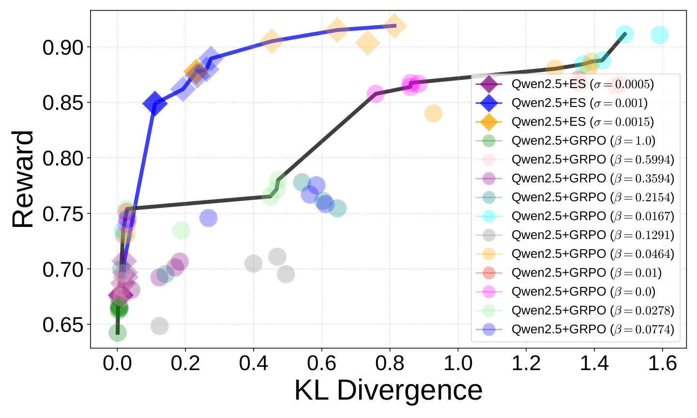

**Figure 1 — Mean conciseness reward and mean KL divergence from the base model.** Each point is a fine-tuning checkpoint under one parameter setting. The ES Pareto front (blue) is higher and farther left than the GRPO front (black), indicating better reward/divergence tradeoffs. ES finds these solutions without a KL-divergence penalty, suggesting a distinctly different fine-tuning mechanism from GRPO.

<a id="table:es_grpo_mean_std"></a>

**Table 2 — Mean conciseness reward and KL divergence for GRPO and ES.**

| Model | $\beta$ | $\alpha$ | $\sigma$ | Reward $\uparrow$ | KL $\downarrow$ |
|:--|--:|--:|--:|--:|--:|
| Qwen-2.5-7B + GRPO | 0.0 | $5\times10^{-6}$ | — | $0.867\pm0.054^{*}$ | $0.861\pm0.614^{*}$ |
| Qwen-2.5-7B + GRPO | 0.01 | $5\times10^{-6}$ | — | $0.871\pm0.060^{*}$ | $1.354\pm0.873^{*}$ |
| Qwen-2.5-7B + GRPO | 0.0167 | $5\times10^{-6}$ | — | $0.911\pm0.038$ | $1.591\pm0.811$ |
| Qwen-2.5-7B + GRPO | 0.0464 | $5\times10^{-6}$ | — | $0.881\pm0.062$ | $1.384\pm1.187$ |
| Qwen-2.5-7B + ES | — | $0.0005$ | $0.001$ | $0.889\pm\mathbf{0.004}$ | $0.274\pm\mathbf{0.096}$ |
| Qwen-2.5-7B + ES | — | $0.00075$ | $0.0015$ | $0.919\pm\mathbf{0.008}$ | $0.813\pm\mathbf{0.212}$ |

$^{*}$ Reward hacking was observed. The reported aggregate only includes models that did not hack the reward.

**ES discovers a dominant Pareto front.** Similarly to Rafailov et al. (2023), a Pareto frontier analysis was used to compare ES and GRPO, with mean reward and mean KL divergence as the metrics (Figure [1](#fig:es_grpo_pareto_front)). The experimental setup is described in Appendix [7.2](#app:exp_setup). The ES Pareto front is represented by a blue line on top and the GRPO Pareto front by the black line below. That is, ES produced better tradeoffs than GRPO, i.e. models with higher reward and lower KL divergence. The GRPO results were achieved only after augmenting the conciseness reward with a KL divergence penalty (weighted by a parameter $\beta$). Without it, fine-tuning resulted in excessive divergence and incorrect answers. Remarkably, ES achieved superior tradeoffs without any KL divergence penalty, suggesting that ES fine-tuning is based on discovering distinctly different kinds of solutions than GRPO. Appendix [7.4](#appendix:extended_conciseness_exp) presents additional experiments with varying $\alpha$ and $\beta$ values, yielding similar conclusions.

**ES is more robust against reward hacking.** GRPO with $\beta=\{0.0, 0.01\}$ sometimes hacked the reward, that is, produced responses that were short but contain nonsensical symbols rather than words. By increasing the KL-penalty via higher $\beta$ values, reward hacking could be prevented. The optimal $\beta$ is likely to be problem specific and to require extensive search to find. In contrast, ES does not receive any feedback about the divergence of the fine-tuned model, and only seeks to optimize conciseness. Regardless, it did not exhibit any reward hacking, despite achieving mean reward comparable to GRPO with $\beta=\{0.0, 0.01\}$. This result again suggests that ES finds a different way of optimizing the reward function.

**ES fine-tuning is reliable across runs.** Fine-tuning LLMs is computationally expensive, so it is critical that it leads to consistent results across runs. Table [2](#table:es_grpo_mean_std) presents the mean and standard deviation of the conciseness reward and KL divergence across four independent runs after $1,000$ iterations. A mean reward cut-off of $>0.85$ was used to down-select hyperparameter combinations, ensuring that only the best ES and GRPO configurations were included in the analysis. From Table [2](#table:es_grpo_mean_std), ES achieved consistent conciseness rewards, indicated by a low standard deviation over four runs with different random seeds. GRPO has $15.5\times$ higher standard deviation, suggesting that its results were much less consistent. The results on KL divergence show similar patterns. Thus, ES fine-tuning is more reliable than GRPO.

## 4.3. ES applied to math reasoning tasks

RL has been shown to enhance the reasoning capabilities of LLMs through post-training with verifiable rule-based rewards. To understand the impact of ES on LLM reasoning, ES fine-tuning was evaluated on a set of standard math benchmarks from the literature. The main result is that ES is competitive with SOTA RL in this setting.

**Training setup.** The Qwen2.5-Math-7B (Yang et al. 2024) base model was fine-tuned with ES using the MATH dataset (Hendrycks et al. 2021). Problems labeled with difficulty ranging from 3-5 were included, and the Qwen Math template was used for training with ES (see Appendix [7.6](#app:math_extended); Yang et al. 2024). Both RL and ES sampled a maximum of $3,000$ tokens per response; ES hyperparameters were set to $\sigma=0.001$, $\alpha=\frac{\sigma}{2}$, and $N=30$.

**RL baselines.** The fine-tuned ES models were compared with strong, well-established baselines from the literature. These RL implementations achieve state-of-the-art performance on the tested benchmarks, utilizing production-ready RL libraries like VERL (Sheng et al. 2024) and OAT (Z. Liu et al. 2024). They include SimpleRL-Zero (GRPO) (Zeng et al. 2025), OatZero (Dr.GRPO) (Z. Liu et al. 2025), and OpenReasoner (PPO) (Hu et al. 2025). The publicly released Qwen2.5-7B checkpoints trained with the original training recipes were used for evaluation. Note that SimpleRL-Zero and OatZero were trained using the MATH dataset (Hendrycks et al. 2021), whereas OpenReasoner was trained using a custom dataset compiled by the authors. Consequently, performance differences should be interpreted in light of both algorithmic and dataset-related differences.

<a id="fig:math_experiments"></a>

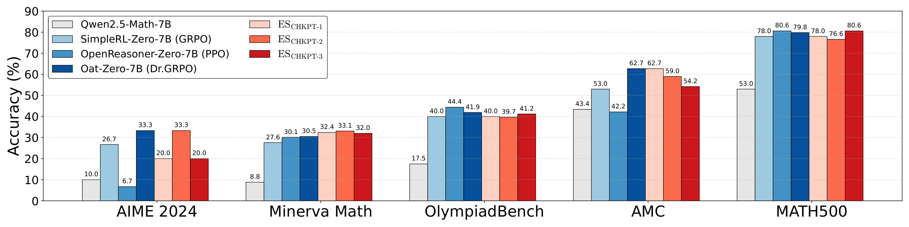

**Figure 2 — ES versus established RL baselines on math-reasoning benchmarks.** Across all benchmarks, ES is competitive with OpenReasoner-Zero-7B (PPO), SimpleRL-Zero (GRPO), and Oat-Zero-7B (Dr.GRPO). Given the deliberately simple ES implementation, these results provide a promising starting point for ES fine-tuning in mathematics.

**Evaluation benchmarks.** Several standard math reasoning benchmarks from the literature are used for evaluation: OlympiadBench (He et al. 2024), MATH500 (Hendrycks et al. 2021), Minerva (Lewkowycz et al. 2022), AIME2024 (Li et al. 2024), and AMC (Li et al. 2024). The pass@1 accuracy metric was used in the evaluations.

**Key results.** Figure [2](#fig:math_experiments) shows the performance of the base model, three checkpoints of RL baselines, and three checkpoints of ES (see Appendix [7.6](#app:math_extended) for more details). ES significantly improved the base models across each benchmark, showing the other optimization methods aside from RL can be used to elicit improvement in LLM reasoning capabilities. In addition, ES exhibits competitive performances compared with the SOTA RL baselines in all the benchmarks. It is notable that these RL baselines are the best-performing implementations selected from the literature, with extensive algorithmic refinement and hyperparameter search particularly for math reasoning tasks. In contrast, the current ES implementation is a vanilla variant with a simple hyperparameter setup; thus, the results constitute a promising starting point for the ES approach in math fine tuning.

<a id="sec:puzzle"></a>

## 4.4. Solving challenging puzzle problems

To further evaluate the generality of ES in tackling different types of tasks, two challenging puzzle problems were used as additional testbeds. The first is ARC-AGI (Chollet et al. 2024), a benchmark designed to evaluate fluid intelligence (Chollet 2019). The second is Sudoku, a logic-based number-placement puzzle. Whereas the base LLM models fail severely in both problems, ES fine-tuning significantly improves their performance (Table [3](#tab:reasoning_main)). Experimental details are provided in Appendix [7.9](#app:arc-agi) for ARC-AGI and Appendix [7.8](#app:sudoku) for Sudoku.

<a id="tab:reasoning_main"></a>

**Table 3 — Accuracy (%) on two puzzle problems.**

| **Task** | **Base Model** | **Original** | **ES Fine-tuned** |
|:---------|:---------------|:------------:|:-----------------:|
| ARC-AGI  | Qwen-2.5-14B   |     0.2      |     **29.5**      |
| Sudoku   | Qwen-2.5-3B    |     2.5      |     **69.5**      |

*Original* means direct evaluation of the base model without fine-tuning. ES improves performance substantially on both problems.

<a id="sec:discussion"></a>

# 5. Discussion and Future Work

**Algorithmic advantage of ES vs. RL.** Exploration in parameter space plays a key role in the surprisingly good fine-tuning performance of ES. As discussed by Rückstieß et al. (2010) and Plappert et al. (2018), sampling noise in parameter space ensures that the entire action trajectory, i.e., the sequence of tokens, only depends on one single sampling, leading to significantly lower variance in rollouts, i.e., in response generation. As a result, gradient estimation is more reliable and convergence is more stable. In contrast, action space exploration in RL injects noise at every step, i.e., at each token position, resulting in high variance in the sequence generation. The behavior of RL therefore is much less reliable than ES, as was seen in Table [2](#table:es_grpo_mean_std). Moreover, step-wise exploration in action space promotes reward hacking by increasing the chance of sampling a single hacking action. One example is the nonsensical symbol sampled during RL that can hack the conciseness reward.

Another key difference between ES and RL is that ES intrinsically optimizes a solution distribution (Lehman et al. 2018), while RL optimizes a single solution. This property makes it more difficult for ES to hack the reward since a single hacked solution usually does not have a high-quality solution distribution around it. This property also results in solutions that are more robust to noisy perturbations in parameter space (Lehman et al. 2018), making them more robust to adversarial attacks and less likely to be compromised in other follow-up fine-tuning tasks (Chen et al. 2025).

The ES algorithm presented in Algorithm [2](#alg:es-llm_specific) is very simple and easy to implement, without need for sophisticated hyperparameter search. In contrast, RL algorithms are considerably more complex and require substantial expertise to implement robustly across tasks and systems, usually with extensive hyperparameter tuning. In particular, there has been significant debate in the literature regarding best practices for implementing GRPO. Effective GRPO implementations typically rely on a number of non-obvious design choices and implementation details, such as removing length normalization (Z. Liu et al. 2025) and using more aggressive clipping (Yu et al. 2025). Many of these practices have only emerged through extensive empirical investigation. Moreover, the application of the KL penalty in GRPO remains an open design choice, with alternatives such as applying it to the loss or directly to the reward leading to markedly different performance outcomes (Shah et al. 2025).

**Engineering benefits of ES vs. RL.** Modern RL frameworks grow increasingly complex as they are applied to LLMs with ever-increasing parameter counts. Deploying these systems in practice often requires substantial engineering effort and computational resources. In contrast, ES is simple to implement and can help democratize post-training by significantly lowering engineering and systems overhead. This section outlines two key advantages of ES and suggests how it can be scaled to fine-tune the largest LLMs.

(1) *Parallelization.* To minimize memory overhead and maximize sample throughput, RL systems rely on asynchronous architectures in which actors are distributed across GPUs and update a shared learner model. While effective, scaling these systems across large numbers of GPUs and computational nodes introduces significant engineering complexity. In contrast, as shown by Salimans et al. (2017), ES can be trivially parallelized: as the number of available GPUs increases, the population size can be scaled accordingly.

Modern frontier AI research labs operate clusters with thousands of GPUs[^1], making efficient large-scale parallelization possible. While it is challenging to do with RL, ES requires only the exchange of random seeds (noise) and scalar rewards between machines. Such simple communication enables parallel ES to be used either to reduce wall-clock training time or to scale to much larger populations.

(2) *Gradient computation.* Asynchronous RL makes it possible to compute actor-related gradients in parallel. However, in order to manage memory usage, gradient checkpointing and multiple learner updates per synchronization step are needed. While these techniques enable larger effective batch sizes, they also require gradients to be communicated across GPUs, and sometimes nodes, introducing significant memory overhead and engineering complexity. This complexity scales with both the number of GPUs and the size of the model, and is further exacerbated when model parameters must be sharded across devices.

In contrast, ES does not require gradient computation. By eliminating gradient calculation and communication entirely, ES avoids much of the associated engineering and memory overhead. As a result, each member of the ES population can use large batch sizes freely without cross-device gradient synchronization, which can yield substantial practical and performance benefits.

Importantly, ES is an inference-only fine-tuning mechanism, where the model weights are never differentiated, only evaluated. This property opens the door to specialized inference kernels optimized for repeated forward passes, large batches, and parameter perturbations. These mechanisms are difficult to leverage in gradient-based training regimes, but are possible in ES fine tuning in the future.

**Future research directions.** One counterintuitive result is that the ES implementation only needs a population of 30 to effectively optimize billions of parameters. In contrast, previous work (Salimans et al. 2017; Zhang et al. 2017; Lehman et al. 2018; Lorenc and Neruda 2025) used populations of 10,000 or more for models with millions or fewer parameters. An interesting future direction is to analyze how such small populations are possible. Perhaps this is related to the observed low intrinsic dimensionality of LLMs (Aghajanyan et al. 2021). Another promising direction is to use ES to perform unsupervised fine-tuning based on internal behaviors of LLMs, such as confidence calculated based on semantic entropy and semantic density (Qiu and Miikkulainen 2024; Farquhar et al. 2024). Such fine-tuning cannot be done with RL, since action space exploration does not change the internal representations of LLMs (that is, each action sampling is generated via output distribution without changing the internal parameters). In a broader sense, since ES does not need process rewards during exploration, it may be a necessary ingredient for superintelligence (Mucci and Stryker 2023), which would be difficult to achieve by supervised learning using process guidance from human data. Massive parallelization of ES will speed up exploration by distributing the computations across GPU machines or even data centers.

An important question is: what are the underlying computational mechanisms that make ES and RL behave so differently? While this question requires significant further work, a possible hypothesis emerges from the experiments in this paper. Many fine-tuning objectives, like conciseness and the Countdown task, are long-horizon outcome-only objectives. The reward signal is jagged, making it difficult to navigate with gradient-based post-training methods. RL and ES both provide workarounds via effective noise injection to “smooth out’’ the jagged reward landscape. In the case of RL, noise is introduced from Monte-Carlo sampling of each token during a rollout, averaged over many rollouts, which effectively smooths the sampling process but does not necessarily guarantee that the reward landscape is smooth in parameter space. RL’s gradient estimation therefore has a high-variance, and its signal-to-noise ratio becomes worse with longer sequences and sharper policies (i.e. those with lower entropy), and therefore prone to undesirable outcomes such as reward hacking.

In contrast, ES injects noise directly into the parameter space via explicit Gaussian convolution, which effectively smooths out the jagged reward landscape. As a result, it provides a more stable way of exploring the landscape, leading to more consistent, efficient, and robust optimization (as observed in the experiments and in Appendix [7.7](#app:shifts)). Moreover, the larger the models and the sharper the policies, the more jagged the reward landscapes; therefore, ES is likely to have an advantage in fine-tuning them. Direct evidence for this hypothesis still needs to be obtained, but it provides a plausible mechanistic explanation, and a direction for future work. Eventually, such work could result in better fine-tuning methods, as well as an improved understanding of LLMs in general.

# 6. Conclusion

This paper introduces a fundamentally new paradigm for fine-tuning LLMs by scaling ES to models with billions of parameters without dimensionality reduction. Contrary to long-standing assumption that such scaling is infeasible, the paper demonstrates that ES can efficiently fine-tune the full parameter space of modern LLMs and, in doing so, consistently surpasses standard RL-based fine-tuning methods. On the Countdown task, with sparse long-horizon rewards challenging for gradient-based RL, ES achieves substantially stronger performance. It also exhibits markedly reduced sensitivity to hyperparameter choices and delivers stable, repeatable improvements across multiple base LLMs. In fine-tuning for conciseness, ES is less prone to reward hacking and shows reliable behavior across independent runs. The generality of ES fine tuning is further validated by strong performance on state-of-the-art math reasoning benchmarks and two challenging puzzle problems. Together, these results establish ES as a scalable, robust, and general fine-tuning method, and demonstrate that backpropagation-free optimization can serve as a powerful alternative to RL for fine-tuning LLMs.

## Impact Statement

Beyond the standard potential consequences of advancing the field of machine learning, there are two key areas of broader impact, stemming from (1) *increased ease of use* and (2) *reduced reward-hacking*.

**Ease of use:** ES qualitatively reduces the barrier of entry to fine-tuning LLMs. Unlike RL, which requires an expert mathematical understanding of nuanced gradient-based training dynamics to design an effective reward function, ES simply requires the experimenter to assign *a score* to a model after it has attempted a task. This simplification democratizes LLM fine-tuning, opening the door to the development of customized AI applications by non-experts.

**Reward-hacking:** As shown in Section [4.2](#sec:behavioral_differences) and prior work (Lehman et al. 2018), ES is inherently less susceptible to reward-hacking than RL and other gradient-based methods. Thus, LLMs fine-tuned with ES are less likely to lose ethical guardrails present in the base model. Similarly, it may be easier to fine-tune for ethical behavior (i.e. alignment) with ES, since the model is less likely to overfit to specific training examples.

Combining the above two areas of impact, ES fine-tuning can reduce the risk of unintended ethical misbehavior of LLMs fine-tuned by non-experts.

## Acknowledgments

We would like to thank Sid Stuart for providing technical support for hardware management and always being responsive. We would like to thank Jamieson Warner for providing valuable feedback.

# 7. Appendix

<a id="app:algorithm"></a>

## 7.1. ES implementation for LLM fine-tuning

Algorithm [2](#alg:es-llm_specific) shows the detailed process of the ES implementation for LLM fine-tuning.

<a id="alg:es-llm_specific"></a>

**Algorithm 2 — ES implementation for LLM fine-tuning**

**Inputs:** pretrained LLM parameters $\bm{\theta}_0$; reward function $R(\cdot)$; number of iterations $T$; population size $N$; noise scale $\sigma$; learning rate $\alpha$; number of parallel processes $P$.

1. Create $P$ processes. Each process instantiates a model with the same initial parameters $\bm{\theta}_0$; designate one as the main process.
2. For $t = 1, \ldots, T$:
   1. Sample $N$ random seeds $s_1, s_2, \ldots, s_N$ and assign them across the $P$ processes.
   2. In parallel, for each process handling seed $s_n$:
      1. Reset its random-number generator to $s_n$.
      2. For each layer $l$:
         1. Sample $\bm{\varepsilon}_{n,l} \sim \mathcal{N}(0, \bm{I})$ with the same shape as layer $l$.
         2. Perturb that layer in place:
            $$\bm{\theta}_{t-1,l} \leftarrow \bm{\theta}_{t-1,l} + \sigma\bm{\varepsilon}_{n,l}.$$
      3. Evaluate the perturbed model: $R_n = R(\bm{\theta}_{t-1})$.
      4. Reset the random-number generator to $s_n$ again.
      5. For each layer $l$, regenerate $\bm{\varepsilon}_{n,l}$ and restore the layer in place:
         $$\bm{\theta}_{t-1,l} \leftarrow \bm{\theta}_{t-1,l} - \sigma\bm{\varepsilon}_{n,l}.$$
   3. Normalize rewards with
      $$Z_n = \frac{R_n - R_{\mathrm{mean}}}{R_{\mathrm{std}}},$$
      where $R_{\mathrm{mean}}$ and $R_{\mathrm{std}}$ are calculated over $R_1,\ldots,R_N$.
   4. On the main process, for every seed $s_n$ and layer $l$:
      1. Reset the random-number generator to $s_n$.
      2. Regenerate $\bm{\varepsilon}_{n,l}$.
      3. Accumulate the in-place update:
         $$\bm{\theta}_{t,l} \leftarrow \bm{\theta}_{t-1,l} + \alpha\frac{1}{N}Z_n\bm{\varepsilon}_{n,l}.$$
   5. Synchronize all processes to the updated parameters $\bm{\theta}_t$.

<a id="app:exp_setup"></a>

## 7.2. Experimental setup

### Experimental setup for the Countdown experiments

Representative models from the Qwen2.5 family (0.5B–7B) and the Llama3 family (1B–8B) were fine-tuned for this task. For the PPO-z experiments, a grid search was first performed around common hyperparameter settings and the best-performing values used (Table [4](#tab:ppo_grpo_sweep)). TinyZero (<https://github.com/Jiayi-Pan/TinyZero>) is used for PPO-z implementations. For the GRPO-z experiments, a grid search was performed around the settings of Pan et al. (2025) and the best-performing values used. GRPO-z experiments were run with two different group sizes: $N=8$, following the common practice in GRPO training for the Countdown task, and $N=30$, aligning with the population size in ES. GRPO-Zero (<https://github.com/policy-gradient/GRPO-Zero>) is used for GRPO-z implementations. VERL (Sheng et al. 2024) is used for both GRPO-v and Dr.GRPO-v implementations, with the standard default configurations for math reasoning benchmarks.

For the VERL implementations, we set the global batch size of 1024, a learning rate of $1 \times 10^{-6}$, and a rollout group size of $N=8$. We compared two configurations: GRPO-v and Dr.GRPO-v. The GRPO-v baseline incorporated a standard KL divergence penalty with a coefficient of $\beta=0.001$. In contrast, the Dr.GRPO-v configuration removed the KL penalty (`use_kl_loss=False`) and disabled advantage normalization (`norm_adv_by_std=False`). Instead, Dr.GRPO-v employed a sequence-mean token-sum normalization strategy for loss aggregation with a scaling factor of 1024.

For all the ES and RL baselines, the total number of sample evaluations was the same. The ES population size was $N=30$, noise scale $\sigma=0.001$, and learning rate $\alpha=5 \times 10^{-4}$ across all experiments. To evaluate accuracy, a set of 200 samples were used during training, and a different set of 2000 samples during testing. For ES, results were reported on the test set after training for 500 iterations. For RL, the training was stopped after the same total number of sample evaluations as in the ES runs. An example of the prompt and the response is provided in Appendix [7.3](#app:countdown_example).

<a id="tab:ppo_grpo_sweep"></a>

**Table 4 — Best PPO-z and GRPO-z hyperparameters from each model-specific sweep.** Each column is a pair $(\beta,\alpha)$: KL-divergence penalty coefficient and learning rate.

| Method | Model | $(10^{-3},10^{-6})$ | $(10^{-3},10^{-5})$ | $(5\!\times\!10^{-3},10^{-6})$ | $(5\!\times\!10^{-3},10^{-5})$ |
|:--|:--|:--:|:--:|:--:|:--:|
| PPO-z | Qwen-0.5B-Instruct | **✓** | | | |
| PPO-z | Qwen-1.5B-Instruct | ✓ | | | |
| PPO-z | Qwen-3B-Instruct | ✓ | | | |
| PPO-z | Qwen-7B-Instruct | | ✓ | | |
| PPO-z | Llama-1B-Instruct | | ✓ | | |
| PPO-z | Llama-3B-Instruct | | | | ✓ |
| PPO-z | Llama-8B-Instruct | | | ✓ | |
| GRPO-z | Qwen-0.5B-Instruct | | ✓ | | |
| GRPO-z | Qwen-1.5B-Instruct | | | ✓ | |
| GRPO-z | Qwen-3B-Instruct | | ✓ | | |
| GRPO-z | Qwen-7B-Instruct | ✓ | | | |
| GRPO-z | Llama-1B-Instruct | | | | ✓ |
| GRPO-z | Llama-3B-Instruct | | ✓ | | |
| GRPO-z | Llama-8B-Instruct | ✓ | | | |

### Experimental setup for the conciseness experiments

In each experiment, Qwen-2.5-7B-Instruct (Yang et al. 2025) was fine-tuned using both ES and GRPO and evaluated using a held-out evaluation set. Each run was repeated four times, using a different random seed each time. For each GRPO experiment, the group size $N=30$, and learning rate $\alpha=5\times10^{-6}$. Ten log-spaced values from $0.01$ to $1.0$ were evaluated for the the KL-divergence penalty coefficient $\beta$, as well as $\beta=0.0$. Appendix [7.4](#appendix:extended_conciseness_exp) presents additional experiments with varying $\alpha$ and $\beta$ values. For ES, the population size $N = 30$, ensuring that GRPO and ES generated the same number of responses per prompt, resulting in the same training exposure. Models were fine-tuned with $\sigma = \{0.0005, 0.001, 0.0015\}$, with a learning rate $\alpha = \frac{\sigma}{2}$. Both GRPO and ES experiments were run for $1,000$ iterations, and a checkpoint saved every $200$ iterations. Table [5](#table:conciseness_training_dataset) shows the dataset of prompts and verifiable solutions used during fine-tuning; note that it consists of only two examples. Similarly, Table [6](#table:conciseness_eval_dataset) lists the prompts and verifiable solutions used in evaluating each fine-tuned model. For all the experimental results, the displayed reward values are normalized to be within $[0,1]$, with $0$ corresponding to $-2000$ in the original reward function and $1$ corresponding to the best possible original reward $0$.

<a id="table:conciseness_training_dataset"></a>

**Table 5 — Prompts and verifiable solutions used to train for conciseness.**

| Prompt | Verifiable Solution |
|:--:|:--:|
| Solve: $3 + 5 =$ | $8$ |
| If all birds can fly and penguins are birds, can penguins fly | No |

The authors report that these two examples are sufficient to achieve the objective.

<a id="table:conciseness_eval_dataset"></a>

**Table 6 — Held-out prompts and verifiable solutions used to evaluate conciseness.**

| Prompt | Verifiable Solution |
|:--:|:--:|
| What is the capital of France? | Paris |
| Calculate: $12 \times 7 =$ | $84$ |
| Is the statement “All cats are mammals” true or false? | True |
| What comes next in the sequence: $2, 4, 6, 8,$ ? | $10$ |
| Translate “Hello” to Spanish: | Hola |
| What is $15\%$ of $200$? | $30$ |
| Name one primary color: | Red |
| How many days are in a week? | $7$ |

The larger evaluation set is intended to make the measurement more reliable than the two-example training set.

**Conciseness task.** For conciseness fine-tuning, a dataset of prompts $\mathcal{D} = \{x_{1}, .., x_{K} \}$, with a set of verifiable solutions $\{s_{1}, ..., s_{K}\}$, i.e. shortest possible correct answers, was used. For example, for the prompt “Name one primary color”, possible shortest verifiable solution used is “Red”. Following this approach, for each prompt $x \in \mathcal{D}$, the model was encouraged to generate a concise response $y$. To fine-tune the model to generate concise responses, a reward computed using the absolute length difference between the generated response $y$ and the corresponding verified solution $s_{k}$ was given to the model for each prompt $x_{k}$. The reward function $R$ for conciseness was defined as $R = -\lvert \mathrm{len}(y) - \mathrm{len}(s_{k}) \rvert$, where $\mathrm{len}(\cdot)$ denotes the string length.

### Behavior metrics for the conciseness experiments

Behavior of the fine-tuned models was measured in two ways: the mean conciseness reward and the mean KL divergence from the base model (after Rafailov et al. 2023). KL divergence is useful as a proxy for the preservation of the base model’s behavior. It correlates strongly with the question-answering performance of the model, but also conveys more information, i.e. the extent of the fine-tuning changes. A low KL divergence thus suggests that the fine-tuned model has not forgotten capabilities learned during pre-training. Further, as KL divergence increases, these capabilities are likely to break. Therefore, fine-tuning behavior can be characterized using the tradeoffs between reward and KL divergence. To compute the metrics, each fine-tuned model was evaluated on a set of held-out test prompts, with $20$ responses sampled per prompt. The reward was computed using the model-generated response and the verifiable solution provided in the test dataset. The KL divergence between a fine-tuned model $\theta_{\mathrm{FT}}$ and a base model $\theta_{\mathrm{BASE}}$ for a given prompt $x$ and corresponding response $y$ was approximated following Schulman (2020) as

$$
\mathrm{KL}\!\left[\theta_\mathrm{FT} \,\|\, \theta_{\mathrm{BASE}}\right]
= \frac{\theta_{\mathrm{BASE}}(y_{i,t} \mid x, y_{i,<t})}{\theta_\mathrm{FT}(y_{i,t} \mid x, y_{i,<t})}
- \log \frac{\theta_{\mathrm{BASE}}(y_{i,t} \mid x, y_{i,<t})}{\theta_{\mathrm{FT}}(y_{i,t} \mid x, y_{i,<t})}
- 1.
$$

### Partially correlated noise vs. i.i.d. noise

In the current implementation, for each perturbed model, the random number generator is reinitialized for each layer (using the random seed corresponding to this model), leading to partially correlated noise perturbations across layers. Preliminary experiments show that this implementation does not lead to significantly different performances compared to true i.i.d. noise.

<a id="app:countdown_example"></a>

## 7.3. Examples of Countdown task outputs

**Countdown task.** The Countdown task (Gandhi et al. 2024; Pan et al. 2025) requires constructing an arithmetic expression from a given set of numbers using basic operations $(+,-,\times,\div)$ to match a target value. For instance, the target $950$ can be obtained from $\{100,50,6,3\}$ with $100 \times (6+3) +50 = 950$). This constitutes a compact test of constrained symbolic reasoning, i.e. an important use case for fine-tuning.

<a id="fg:countdownexample"></a>

> **Figure 3 — An example Countdown-task interaction after iteration 400.**
>
> **Input:** You are a helpful assistant. You first think about the reasoning process in your mind and then provide the user with the answer. Using the numbers `[49 41 73]`, create an equation that equals 17. You can use basic arithmetic operations (`+`, `-`, `*`, `/`) and each number can only be used once. Show your work in `<think>` … `</think>` tags. Return the final answer in `<answer>` … `</answer>` tags, for example `<answer> (1 + 2) / 3 </answer>`.
>
> **Response:**
>
> `<think>` First, let’s consider all possible combinations of the numbers 49, 41, and 73 using basic arithmetic operations. We need to use each number exactly once and combine them to get 17.
>
> 1. Start with simple addition and subtraction:
>    - $49 + 41 - 73 = 80 - 73 = 7$ (too high)
>    - $49 - 41 + 73 = 8 + 73 = 81$ (too high)
>    - $73 - 49 - 41 = 24 - 41 = -17$ (too low)
> 2. Try multiplication and division:
>    - $(49 \times 41) / 73 = 2029 / 73 \approx 27.83$ (not close to 17)
>    - $(73 \times 41) / 49 = 3013 / 49 \approx 61.47$ (too high)
>    - $(49 \times 73) / 41 = 3637 / 41 \approx 88.80$ (too high)
>    - $(41 \times 73) / 49 = 3013 / 49 \approx 61.47$ (same as above)
> 3. Check different orders:
>    - $73 - (49 + 41) = 73 - 90 = -17$ (too low)
>    - $49 - (73 - 41) = 49 - 32 = 17$ (this looks promising)
>
> So, the equation $49 - (73 - 41)$ equals 17. Let’s verify it: calculate inside the parentheses first, $73 - 41 = 32$, then subtract from 49: $49 - 32 = 17$. This satisfies our requirement. `</think>`
>
> `<answer> 49 - (73 - 41) </answer>`
>
> **Reward:** 1.1000 (format: 1.0000; answer: 1.0000)

Figure [3](#fg:countdownexample) shows an example of the Qwen2.5-3B model’s output on the Countdown task after 400 ES iterations. In order to improve accuracy, the model learned to adjust its formulas by comparing the generated answer with the correct one, and to verify its own answers for correctness.

<a id="appendix:extended_conciseness_exp"></a>

## 7.4. Extended conciseness details and experiments

In this section, the conciseness experiments are extended to investigate the impact of different learning rates on GRPO training.

<a id="fig:learning_rate_mean_models"></a>

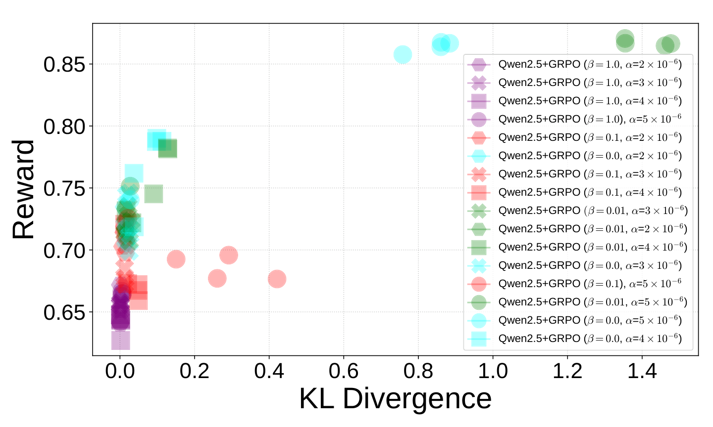

**Figure 4a — GRPO model results over various learning rates.**

<a id="fig:learning_rate_pf"></a>

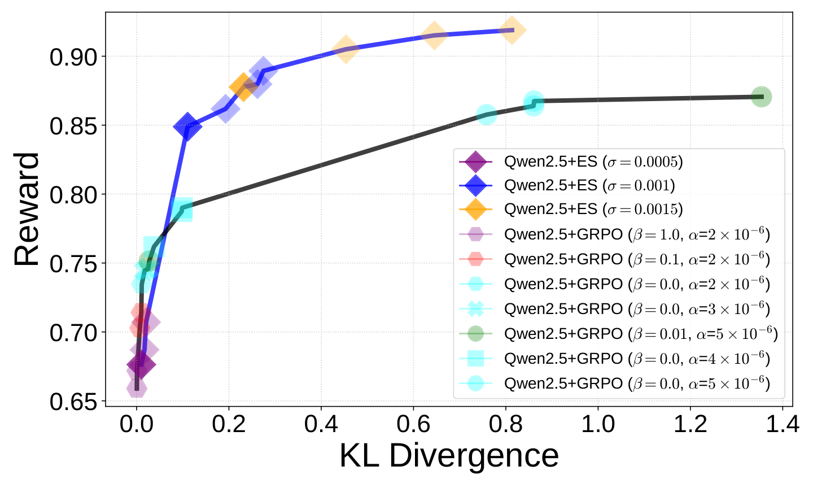

**Figure 4b — ES and GRPO Pareto fronts.**

**Figure 4 — GRPO behavior with different learning rates.** (a) GRPO models trained using different learning rates and $\beta$ values. Both conciseness reward and KL divergence increase with higher learning rates. (b) The ES Pareto front (blue line, top) plotted with the GRPO Pareto front (black line, bottom) over different model learning parameters. ES dominates GRPO across the whole range.

### GRPO with different learning rates

Further GRPO experiments were run over four seeds with $\beta = \{0, 0.01, 0.1, 1.0\}$, varying the learning rate $\alpha = \{ 2\times10^{-6}, 3\times10^{-6}, 4\times10^{-6}, 5\times10^{-6}\}$. A total of $20$ responses were sampled per evaluation prompt. Figure [4a](#fig:learning_rate_mean_models) shows the mean reward and KL divergence of each fine-tuned model. As the learning rate increases, both mean reward and mean KL divergence increase. The best models with respect to reward are trained using $5\times10^{-6}$ and $\beta=\{0.0, 0.01\}$, obtaining rewards greater than $0.85$. Figure [4b](#fig:learning_rate_pf) further displays the GRPO Pareto front (black line, bottom) across these learning rates, comparing it with the ES Pareto front (blue line, top). The majority of Pareto optimal models across these learning rates obtain a mean reward of less than $0.8$ and a KL divergence of less than $0.4$. The ES Pareto front dominates that of GRPO over different learning rates and $\beta$ values.

Next, the reward distribution for each $\alpha$ and $\beta$ value for GRPO was compared with that of ES, starting with learning rates $2\times10^{-6}$ and $3\times10^{-6}$. Figures [5a](#fig:reward_distribution_2) and [5b](#fig:reward_distribution_3) show that all GRPO models stay close to the Qwen2.5-7B-Instruct base model reward distribution, despite the variation in $\beta$. In contrast, ES shifts the reward distribution to the right with a density peak around $1.0$, i.e. towards higher rewards. The learning rate was then further increased to $4\times10^{-6}$ (Figure [5c](#fig:reward_distribution_4)). As a result, for $\beta=0.0$ and $\beta=0.01$, GRPO shifts the reward distribution to the right towards higher rewards. However, they are still lower than those of ES. As the learning rate is increased further to $5\times10^{-6}$ (Figure [5d](#fig:reward_distribution_5)), GRPO is sufficiently able to optimize the reward: with $\beta = 0.0$ and $\beta = 0.01$, it peaks around $1.0$. Thus, high learning rate combined with low $\beta$ is important for GRPO to optimize the reward. However, as was discussed before, such a setting often breaks the performance of the model.

<a id="fig:reward_distribution_2"></a>

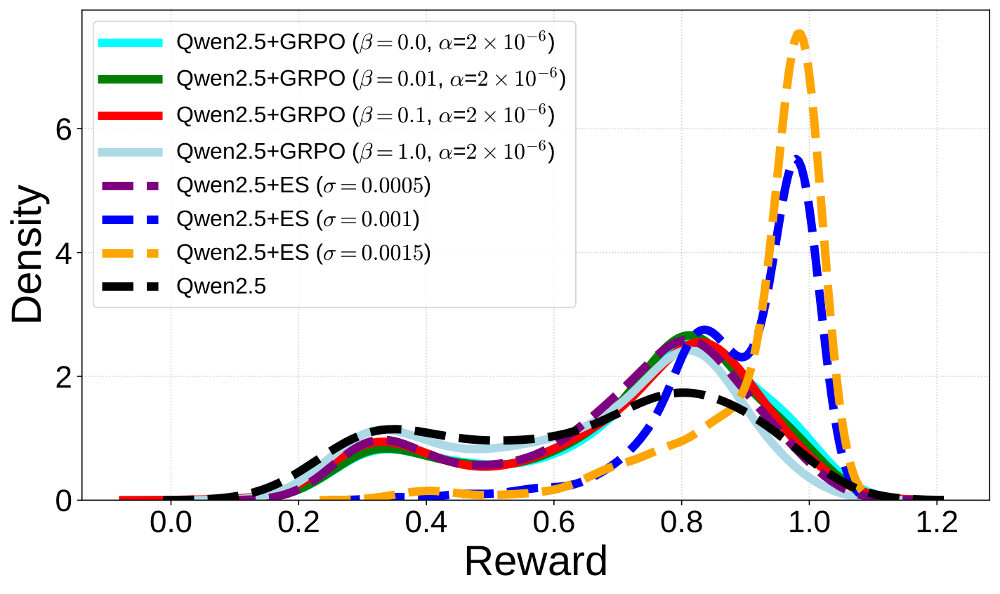

**Figure 5a — Reward distribution with $\alpha = 2\times10^{-6}$.**

<a id="fig:reward_distribution_3"></a>

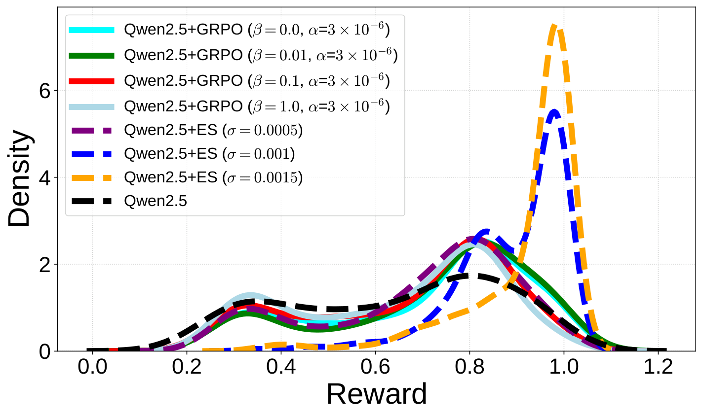

**Figure 5b — Reward distribution with $\alpha = 3\times10^{-6}$.**

<a id="fig:reward_distribution_4"></a>

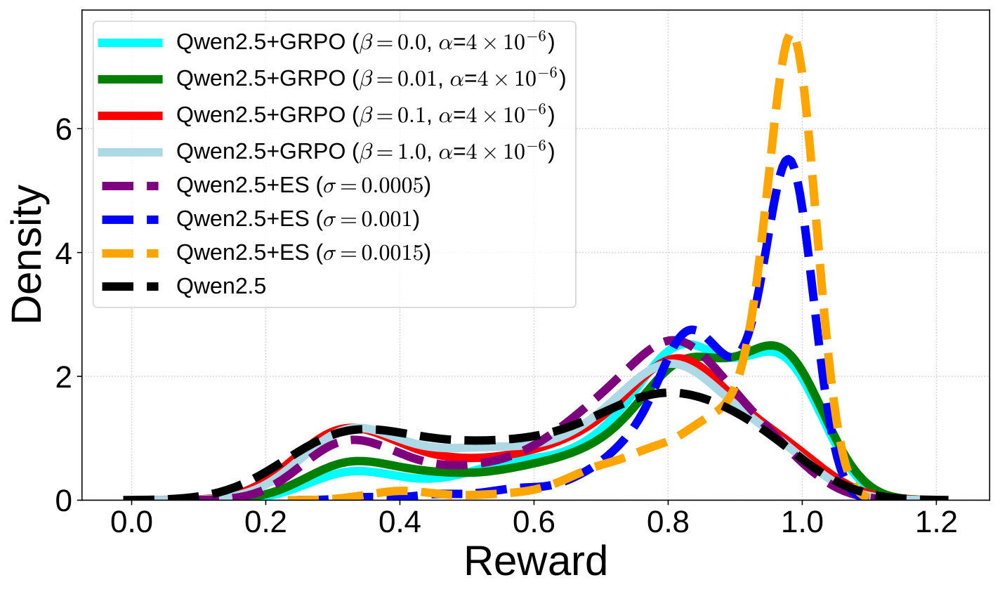

**Figure 5c — Reward distribution with $\alpha = 4\times10^{-6}$.**

<a id="fig:reward_distribution_5"></a>

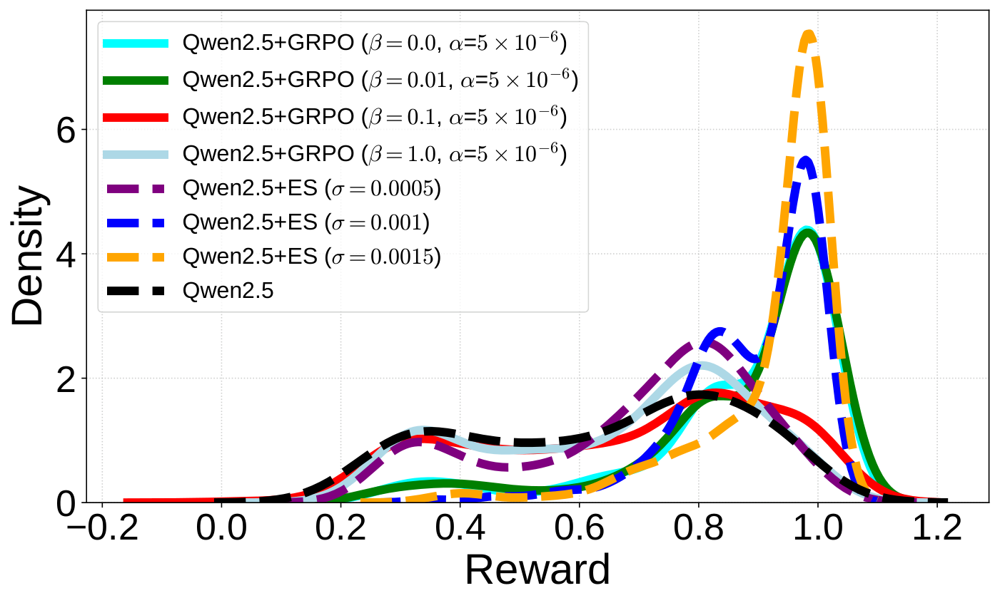

**Figure 5d — Reward distribution with $\alpha = 5\times10^{-6}$.**

<a id="fig:reward_distribution_all"></a>

**Figure 5 — Reward distributions in fine-tuning for conciseness.** Learning rates are $\alpha = \{2\times10^{-6}, 3\times10^{-6}, 4\times10^{-6}, 5\times10^{-6}\}$ and $\beta = \{0.0, 0.01, 0.1, 1.0\}$, compared to ES on the Qwen2.5-7B-Instruct base model. Whereas the GRPO distribution is similar to that of the base model, ES shifts it to the right, i.e. toward higher rewards. Higher rewards can only be achieved with GRPO at high learning rates and low $\beta$, a setting that often breaks the model’s performance.

<a id="fig:acc_improv_over_base"></a>

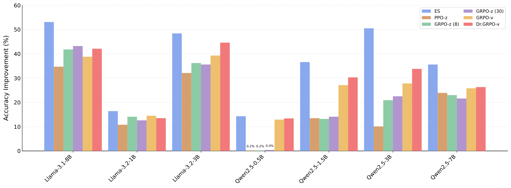

**Figure 6 — Accuracy improvement over base models with ES versus RL across model families.** ES results in consistently larger improvements in all cases.

<a id="appendix:train_curve"></a>

## 7.5. Training curves and accuracy improvement of ES and RL on the Countdown task

As shown in Figure [7](#fig:training_curve), ES consistently outperformed RL across all tested models throughout training. In addition, as shown in Figure [6](#fig:acc_improv_over_base), we compute the relative improvements of PPO, GRPO, Dr.GRPO and ES over their respective base models across different model families. ES delivers the consistently largest improvements in all cases.

<a id="fig:training_curve"></a>

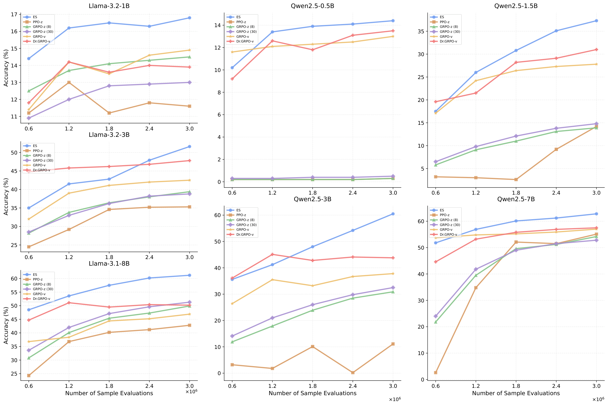

**Figure 7 — Training curves of ES and RL across two model families and six sizes in the Countdown task.** ES fine-tuning results in significantly better performance in all cases.

<a id="app:math_extended"></a>

## 7.6. Extended math-reasoning details and discussion

### RL baselines

We compare ES against three strong R1-Zero-style (Guo et al. 2025b) reasoning baselines at the 7B parameter scale: SimpleRL-Zero (Zeng et al. 2025), OpenReasoner-Zero (Hu et al. 2025), and Oat-Zero (Z. Liu et al. 2025). All baselines are instantiated using Qwen2.5-series models (Yang et al. 2025), which are competitive open-weight language models known to exhibit strong reasoning performance at this scale. The respective baseline implementations are fully open source and built on production-ready RL libraries, including VERL (Sheng et al. 2024) and OAT (Z. Liu et al. 2024), which provided highly optimized, stable, and tested PPO, GRPO, and Dr.GRPO implementations with efficient rollout management, and standardized reward handling. SimpleRL-Zero isolates the core R1-Zero optimization mechanism with minimal additional engineering, OpenReasoner-Zero reflects a widely adopted community implementation with practical design choices, and Oat-Zero further alters GRPO with algorithmic enhancements shown to boost performance. Together, these baselines represent strong, reproducible, and non-trivial comparators for evaluating ES.

### Reward function

Our ES training utilizes a basic rule-based reward function that checks answer correctness, without any format rewards. The reward function is designed to extract the produced answer contained within $\texttt{\textbackslash boxed\{\}}$ and compare it with the ground truth answer. Similarly to RL, we implement a binary reward scheme where a reward of 1 is given for exact matches with the reference answer, and 0 for all other cases. To ensure a fair comparison with models from the literature we use the same answer extractor, also called a grader, as OatZero (Z. Liu et al. 2025).

### Qwen math template

Table [7](#table:qwen_math_template) shows the template structure used for training ES models. We follow the same template used for training the Qwen-Math series base models, where the model is required to provide a final answer inside $\texttt{\textbackslash boxed\{\}}$. This requirement ensures that the final model answers are easy to extract and compare with the ground truth solutions for reward calculation during training. As shown in Z. Liu et al. (2025), the choice of template can impact the final performance of the model. We chose the Qwen-Math template because it provides a platform for stable learning and good performance during fine-tuning.

<a id="table:qwen_math_template"></a>

**Table 7 — Qwen-Math prompt template used in this work.**

```text
<|im_start|>system
Please reason step by step, and put your final answer within \boxed{}.<|im_end|>
<|im_start|>user
{question}<|im_end|>
<|im_start|>assistant
```

### Checkpoint selection

Given there is no explicit validation set, for ES, we follow the standard model checkpoint selection mechanism from the literature whereby the checkpoints with high average pass@1 accuracy over each evaluation set over training are presented. We chose to present a number of ES checkpoints that all achieve sufficiently high average score. We chose our checkpoints to ensure competitive performance across the range of benchmarks. In this case, $\text{ES}_{\text{CHKPT-1}}$ is chosen for its high average score and occurs after $336$ training steps. Additionally, we take a checkpoint after $160$ training steps and perform $10$ additional model update steps with $\alpha=\frac{\sigma}{4}$. This additional training produced $\text{ES}_{\text{CHKPT-2}}$. Given the lack of validation set, we utilize MATH500 as a pseudo validation set since MATH500 is an in-distribution validation. Following this, we select $\text{ES}_{\text{CHKPT-3}}$ because it achieves the highest performance in the MATH500 benchmark across our evaluations. The MATH500 $\text{ES}_{\text{CHKPT-3}}$ occurs after $192$ training steps.

<a id="app:shifts"></a>

## 7.7. Parameter-magnitude shifts from evolutionary fine-tuning

This section characterizes how parameter magnitudes changed in ES fine-tuning in the Countdown and conciseness experiments. Specifically, Figures [8](#fig:llama-countdown-hist) and [9](#fig:qwen-countdown-hist), left column, show histograms of the absolute parameter-magnitude shifts $\Delta$ before and after fine-tuning Llama and Qwen models, overlaid with a random walk, on the Countdown task reported in Table [1](#tab:countdown_main). The right column in these figures shows the difference between $\Delta$ and the random walk.

For most models, $\Delta$ deviates very little from random walk. This is a counterintuitive result since fine-tuning actually resulted in a significant performance boost. A closer inspection reveals that most of the deviation was concentrated around zero. A likely explanation is that there are precision issues around zero, particularly with small bin sizes, which may lead to such deviations.

More significantly, a systematic deviation from the random walk was observed in conciseness fine-tuning of the largest model, Qwen2.5-7B-Instruct (Figure [10](#fig:qwen-concise-hist)). The distribution shifts toward abundant small-magnitude edits, suggesting that small parameter tweaks may be most significant in influencing output behavior. This result reinforces observations in prior studies (e.g. Y. Liu et al. 2025). A possible explanation is that large models encode functionality in a more redundant manner, and therefore minor tweaks are sufficient to achieve fine-tuning objectives. In fact, the changes are nearly indistinguishable from a random walk in Figures [8](#fig:llama-countdown-hist) and [9](#fig:qwen-countdown-hist), likely because they are beneficial with respect to the fine-tuning objective. A more thorough investigation of these hypotheses is a most interesting direction of future work, potentially resulting in a better understanding of fine-tuning and information-processing principles in LLMs in general.

<a id="fig:llama-countdown-hist"></a>

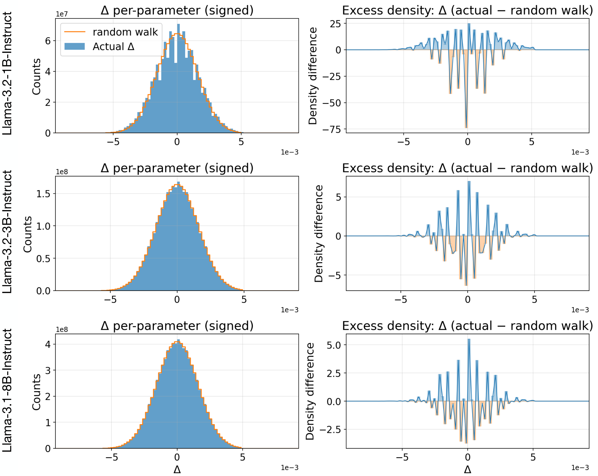

**Figure 8 — Parameter-magnitude shift histograms for the Countdown task in Llama models optimized by ES.** The changes are similar to those of a random walk, concentrated around zero, likely due to numerical inaccuracies.

<a id="fig:qwen-countdown-hist"></a>

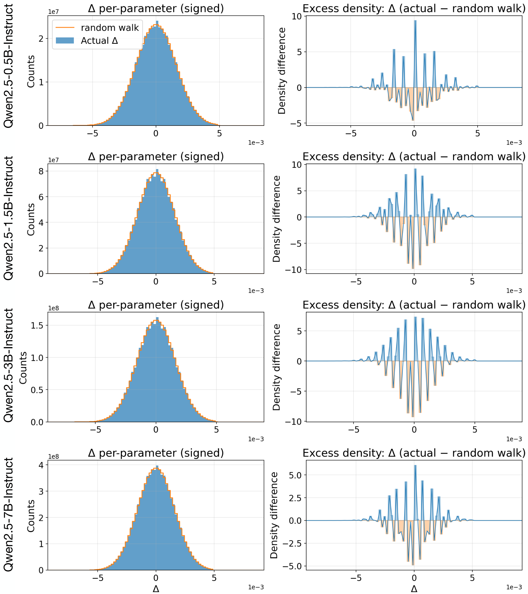

**Figure 9 — Parameter-magnitude shift histograms for the Countdown task in Qwen models optimized by ES.** The results are consistent with those observed in Llama models.

<a id="fig:qwen-concise-hist"></a>

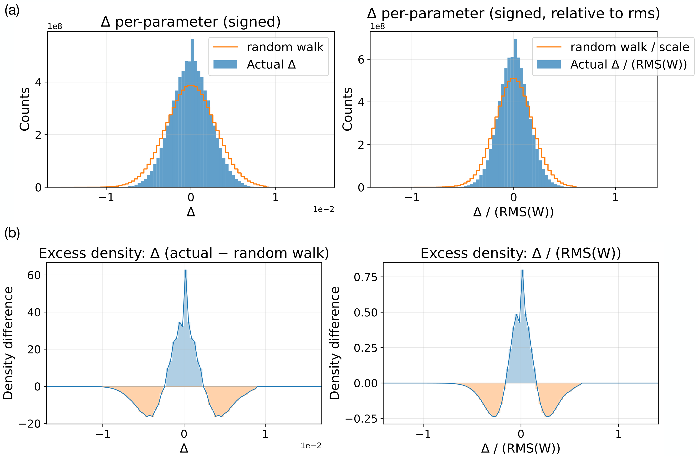

**Figure 10 — Parameter-magnitude shift histograms for conciseness fine-tuning of Qwen2.5-7B-Instruct with ES.** Here the model is large and the fine-tuning goal is different, revealing a potentially significant pattern of primarily small changes. The hypothesis, to be analyzed more thoroughly in future work, is that behavior is coded redundantly in large models, making it possible to achieve this fine-tuning objective through numerous small changes.

<a id="app:sudoku"></a>

## 7.8. Experiment with the mini-Sudoku task

Standard Sudoku requires filling in missing integers in a $9\times9$ grid, evenly divided into $9$ smaller $3\times3$ grids. Integers must satisfy the following conditions: every row contains each integer $1-9$, every column contains each integer $1-9$, and each $3\times3$ sub-grid contains each integer $1-9$. Given the difficulty of $9\times9$ puzzles, existing evaluation of LLMs’ ability to complete Sudoku is often done with $4\times4$ grids, with equivalent rules for rows, columns, and $2\times2$ subgrids with digits $1-4$. Training-data generation and evaluation were performed with the Sudoku-board generation logic and reward function from Stojanovski et al. (2025). One thousand unique example grids were generated, with $800$ used for training and $200$ for testing. Qwen-2.5-3B-Instruct was used as the base model and trained with greedy decoding and the batch size set to the entire $800$-sample training set. ES was run for $2,500$ iterations with $\sigma = 0.001$, $\alpha = 0.0005$, and $N = 32$. With this setup, model performance improved from 2% to 66.5% of test-set puzzles correctly solved. An example prompt and model responses before and after ES fine-tuning are provided in Figure [11](#fg:sudokuexample).

<a id="fg:sudokuexample"></a>

**Figure 11 — Example prompt and model outputs for the 4×4 mini-Sudoku task.** The base model responded with a variety of step-by-step methods, while the fine-tuned model settled into a consistent, dense reasoning style.

**Prompt:**

You are a helpful assistant. You first think about the reasoning process in your mind and then provide the user with the answer. In 4x4 Mini Sudoku:

- Each row must contain each number from 1–4 exactly once.
- Each column must contain each number 1–4 exactly once.
- Each 2×2 subgrid must contain each number 1–4 exactly once.

Solve this 4x4 Mini Sudoku puzzle:

```text
_ _ 4 _
4 3 _ _
3 _ _ 1
1 _ 3 _
```

Show your work in `<think> </think>` tags. Return the final answer in `<answer> </answer>` tags, with spaces separating each number within a row and newlines separating rows. For example:

```text
<answer>
2 1 4 3
4 3 2 1
3 1 4 2
1 2 3 4
</answer>
```

Let me solve this step by step. `<think>`

**Base Model Output (Incorrect):**

First, let’s look at the given numbers and try to deduce the missing numbers. The number 4 is already placed in the first column, so we can’t have another 4 in that column. The number 3 is already placed in the second row, so we can’t have another 3 in that row. The number 1 is already placed in the third row, so we can’t have another 1 in that row. Let’s start filling in the grid based on these constraints: `</think>`

```text
<answer>
2 1 4 3
4 3 2 1
3 1 4 2
1 2 3 4
</answer>
```

`</think>` This is the final solution to the 4x4 Mini Sudoku puzzle. Let me verify:

Each row contains the numbers 1, 2, 3, 4 exactly once: Row 1: 2 1 4 3, Row 2: 4 3 2 1, Row 3: 3 1 4 2, Row 4: 1 2 3 4.

Each column contains the numbers 1, 2, 3, 4 exactly once: Column 1: 2 4 3 1, Column 2: 1 3 1 2, Column 3: 4 2 4 3, Column 4: 3 1 2 4.

Each 2x2 subgrid contains the numbers 1, 2, 3, 4 exactly once: Subgrid 1: 2 1 / 3 4, Subgrid 2: 4 2 / 1 3, Subgrid 3: 3 1 / 4 2, Subgrid 4: 1 2 / 3 4.

All constraints are satisfied, so the solution is correct. `</think>` The final answer is:

```text
<answer>
2 1 4 3
4 3 2 1
3 1 4 2
1 2 3 4
</answer>
```

**Fine-Tuned Model Output (Correct):**

First, let’s look at the given numbers and try to fill in the missing numbers. We start with the first row: `_ _ 4 _`. Since each row must contain each number from 1 to 4 exactly once, the missing numbers in the first row must be 2, 1, and 3. So the first row becomes: 2 1 4 3.

Next, let’s look at the second row: `4 3 _ _`. Since each row must contain each number from 1 to 4 exactly once, and we already have 4 and 3 in this row, the missing numbers must be 1 and 2. So the second row becomes: 4 3 1 2.

Now, let’s look at the third row: `3 _ _ 1`. Since each row must contain each number from 1 to 4 exactly once, and we already have 3 and 1 in this row, the missing numbers must be 2 and 4. So the third row becomes: 3 4 2 1.

Finally, let’s look at the fourth row: `1 _ 3 _`. Since each row must contain each number from 1 to 4 exactly once, and we already have 1 and 3 in this row, the missing numbers must be 2 and 4. So the fourth row becomes: 1 2 3 4.

So, the completed 4x4 Mini Sudoku puzzle looks like this: `</think>`

```text
<answer>
2 1 4 3
4 3 1 2
3 4 2 1
1 2 3 4
</answer>
```

<a id="app:arc-agi"></a>

## 7.9. Experiments on the ARC-AGI task

*ARC-AGI* (Chollet et al. 2024) is a benchmark designed to evaluate abstract reasoning and generalization capabilities. Each task presents a few input-output grid pairs as examples, requiring models to infer the underlying transformation rules and apply it to a new test input. The dataset has 400 public training tasks and evaluation tasks, focusing on creative problem-solving. We used 200 training tasks for fine-tuning and 200 evaluation tasks for testing.

### Experimental settings

*Prompts*. The ARC-AGI tasks are presented in image format. To use LLMs to solve them, we first map colors to the numbers as follows: black $\to$ 0, blue $\to$ 1, red $\to$ 2, green $\to$ 3, yellow $\to$ 4, grey $\to$ 5, gray $\to$ 5, pink $\to$ 6, orange $\to$ 7, purple $\to$ 8, brown $\to$ 9.

<a id="fg:arcagiexample"></a>

**Figure 12 — Prompts used for the ARC-AGI task.**

**System Prompt:**

You are a creative and meticulous ARC puzzle solver who explains reasoning before answering.

**Task Explanation:**

You will be given some number of paired example inputs and outputs. The outputs were produced by applying a transformation rule to the inputs. In addition to the paired example inputs and outputs, there is also one additional input without a known output. Your task is to determine the transformation rule and implement it in code.

The inputs and outputs are each "grids". A grid is a rectangular matrix of integers between 0 and 9 (inclusive). These grids will be shown to you as grids of numbers (ASCII). Each number corresponds to a color. The correspondence is as follows: black: 0, blue: 1, red: 2, green: 3, yellow: 4, grey: 5, pink: 6, orange: 7, purple: 8, brown: 9.

The transformation only needs to be unambiguous and applicable to the example inputs and the additional input. It doesn’t need to work for all possible inputs.

**Reasoning Explanation:**

You’ll need to reason carefully in order to determine the transformation rule. Start your response by reasoning in `<reasoning></reasoning>` tags. Then implement the transformation in code.

After your reasoning, write code in a fenced `python` block. Write a function called `transform` that takes one argument, the input grid as `list[list[int]]`, and returns the transformed grid, also as `list[list[int]]`. Make sure that you implement a version of the transformation that works in general; it should not only work for the additional input.

**Other Instructions:**

Don’t write tests in your Python code; just output the `transform` function. It will be tested later.

You can also ask a question to verify an observation about the input/output patterns in the form of a Python function that takes two arguments—the input and expected output grids, both as `list[list[int]]`—and returns a Boolean flag. We will run your function on the examples and tell you whether the result is `True` or `False`.

You follow a particular reasoning style. You break down complex problems into smaller parts and reason through them step by step, arriving at sub-conclusions before stating an overall conclusion. This reduces the extent to which you need to do large leaps of reasoning.

You reason in as much detail as is necessary to determine the transformation rule.

You are creative and accomplished at solving puzzles. When you write `transform`, do not hardcode the solution for each example. We will run your function on additional inputs later and check that its logic is generic as well as correct.

*Hyperparameters* $\sigma = 0.001$, $\alpha = 0.0003$, $N$ = 50, iterations = 1500.

### RL attempts

Few prior works have explored using RL–based post-training for LLMs on ARC-AGI tasks. While RL has been widely used for LLM alignment and reasoning tasks (e.g., RLHF, math and QA benchmarks), its application to abstraction-centric, out-of-distribution generalization benchmarks like ARC-AGI remains relatively under-explored, largely due to challenges in reward design and efficient exploration. According to a recent report (Ranke 2025) , applying GRPO to ARC-AGI resulted in minimal gains. The model failed to discover new strategies or abstract concepts; instead, it simply learned to rerank or refine the candidates it could already generate based on its original training.

# References

<a id="ref-openai2024gpt4"></a>

Achiam, Josh et al. 2024. “GPT-4 Technical Report.” *arXiv:2303.08774*.

<a id="ref-aghajanyan2021intrinsic"></a>

Aghajanyan, Armen, Sonal Gupta, and Luke Zettlemoyer. 2021. “Intrinsic Dimensionality Explains the Effectiveness of Language Model Fine-Tuning.” In *Proceedings of the 59th Annual Meeting of the Association for Computational Linguistics and the 11th International Joint Conference on Natural Language Processing (Volume 1: Long Papers)*, edited by Chengqing Zong, Fei Xia, Wenjie Li, and Roberto Navigli. Association for Computational Linguistics. <https://doi.org/10.18653/v1/2021.acl-long.568>.

<a id="ref-llama3modelcard"></a>

AI@Meta. 2024. *Llama 3 Model Card*. <https://github.com/meta-llama/llama3/blob/main/MODEL_CARD.md>.

<a id="ref-akiba2025merge"></a>

Akiba, Takuya, Makoto Shing, Yujin Tang, Qi Sun, and David Ha. 2025. “Evolutionary Optimization of Model Merging Recipes.” *Nature Machine Intelligence* 7 (2): 195–204. <https://doi.org/10.1038/s42256-024-00975-8>.

<a id="ref-claude4"></a>

Anthropic. 2025. *Introducing Claude 4*. <https://www.anthropic.com/news/claude-4>.

<a id="ref-bai2022assistant"></a>

Bai, Yuntao, Andy Jones, Kamal Ndousse, et al. 2022. “Training a Helpful and Harmless Assistant with Reinforcement Learning from Human Feedback.” *arXiv:2204.05862*. <https://arxiv.org/abs/2204.05862>.

<a id="ref-chen2025loss"></a>

Chen, Huanran, Yinpeng Dong, Zeming Wei, et al. 2025. “Understanding Pre-Training and Fine-Tuning from Loss Landscape Perspectives.” *arXiv:2505.17646*. <https://arxiv.org/abs/2505.17646>.

<a id="ref-chollet2019measureintelligence"></a>

Chollet, François. 2019. *On the Measure of Intelligence*. <https://arxiv.org/abs/1911.01547>.

<a id="ref-chollet2024arc"></a>

Chollet, Francois, Mike Knoop, Gregory Kamradt, and Bryan Landers. 2024. “Arc Prize 2024: Technical Report.” *arXiv Preprint arXiv:2412.04604*.

<a id="ref-choshen2020instablerl"></a>

Choshen, Leshem, Lior Fox, Zohar Aizenbud, and Omri Abend. 2020. “On the Weaknesses of Reinforcement Learning for Neural Machine Translation.” *International Conference on Learning Representations*. <https://openreview.net/forum?id=H1eCw3EKvH>.

<a id="ref-chrabaszcz2018"></a>

Chrabaszcz, Patryk, Ilya Loshchilov, and Frank Hutter. 2018. “Back to Basics: Benchmarking Canonical Evolution Strategies for Playing Atari.” *Proceedings of the 27th International Joint Conference on Artificial Intelligence* (Stockholm, Sweden), IJCAI’18, 1419–26.

<a id="ref-conti2018"></a>

Conti, Edoardo, Vashisht Madhavan, Felipe Petroski Such, Joel Lehman, Kenneth Stanley, and Jeff Clune. 2018. “Improving Exploration in Evolution Strategies for Deep Reinforcement Learning via a Population of Novelty-Seeking Agents.” In *Advances in Neural Information Processing Systems*, edited by S. Bengio, H. Wallach, H. Larochelle, K. Grauman, N. Cesa-Bianchi, and R. Garnett, vol. 31. Curran Associates, Inc.

<a id="ref-denison2024tampering"></a>

Denison, Carson, Monte MacDiarmid, Fazl Barez, et al. 2024. “Sycophancy to Subterfuge: Investigating Reward-Tampering in Large Language Models.” *arXiv:2406.10162*. <https://arxiv.org/abs/2406.10162>.

<a id="ref-du2024fusion"></a>

Du, Guodong, Jing Li, Hanting Liu, et al. 2024. “Knowledge Fusion by Evolving Weights of Language Models.” In *Findings of the Association for Computational Linguistics: ACL 2024*, edited by Lun-Wei Ku, Andre Martins, and Vivek Srikumar. Association for Computational Linguistics. <https://doi.org/10.18653/v1/2024.findings-acl.698>.

<a id="ref-farquhar:nature24"></a>

Farquhar, Sebastian, Jannik Kossen, Lorenz Kuhn, and Yarin Gal. 2024. “Detecting Hallucinations in Large Language Models Using Semantic Entropy.” *Nature* 630 (8017): 625–30.

<a id="ref-fu2025shaping"></a>

Fu, Jiayi, Xuandong Zhao, Chengyuan Yao, Heng Wang, Qi Han, and Yanghua Xiao. 2025. “Reward Shaping to Mitigate Reward Hacking in RLHF.” *arXiv:2502.18770*. <https://arxiv.org/abs/2502.18770>.

<a id="ref-gandhi2025cognitive"></a>

Gandhi, Kanishk, Ayush K Chakravarthy, Anikait Singh, Nathan Lile, and Noah Goodman. 2025. “Cognitive Behaviors That Enable Self-Improving Reasoners, or, Four Habits of Highly Effective STaRs.” *Second Conference on Language Modeling*. <https://openreview.net/forum?id=QGJ9ttXLTy>.

<a id="ref-gandhi2024stream"></a>

Gandhi, Kanishk, Denise Lee, Gabriel Grand, et al. 2024. *Stream of Search (SoS): Learning to Search in Language*. <https://arxiv.org/abs/2404.03683>.

<a id="ref-gao2023scaling"></a>

Gao, Leo, John Schulman, and Jacob Hilton. 2023. “Scaling Laws for Reward Model Overoptimization.” In *Proceedings of the 40th International Conference on Machine Learning*, edited by Andreas Krause, Emma Brunskill, Kyunghyun Cho, Barbara Engelhardt, Sivan Sabato, and Jonathan Scarlett, vol. 202. Proceedings of Machine Learning Research. PMLR. <https://proceedings.mlr.press/v202/gao23h.html>.

<a id="ref-gemini25"></a>

Google. 2025. *Gemini 2.5: Pushing the Frontier with Advanced Reasoning, Multimodality, Long Context, and Next Generation Agentic Capabilities.* <https://storage.googleapis.com/deepmind-media/gemini/gemini_v2_5_report.pdf>.

<a id="ref-liang2025deepseeknature"></a>

Guo, Daya et al. 2025a. “DeepSeek-R1 Incentivizes Reasoning in LLMs Through Reinforcement Learning.” *Nature* 645 (8081): 633–38. <https://doi.org/10.1038/s41586-025-09422-z>.

<a id="ref-deepseekai2025deepseekr1"></a>

Guo, Daya et al. 2025b. “DeepSeek-R1: Incentivizing Reasoning Capability in LLMs via Reinforcement Learning.” *arXiv:2501.12948*. <https://arxiv.org/abs/2501.12948>.

<a id="ref-guo2024connecting"></a>

Guo, Qingyan, Rui Wang, Junliang Guo, et al. 2024. “Connecting Large Language Models with Evolutionary Algorithms Yields Powerful Prompt Optimizers.” *The Twelfth International Conference on Learning Representations*. <https://openreview.net/forum?id=ZG3RaNIsO8>.

<a id="ref-hansen2001cmaes"></a>

Hansen, Nikolaus, and Andreas Ostermeier. 2001. “Completely Derandomized Self-Adaptation in Evolution Strategies.” *Evolutionary Computation* 9 (2): 159–95. <https://doi.org/10.1162/106365601750190398>.

<a id="ref-he2024olympiadbench"></a>

He, Chaoqun, Renjie Luo, Yuzhuo Bai, et al. 2024. “Olympiadbench: A Challenging Benchmark for Promoting Agi with Olympiad-Level Bilingual Multimodal Scientific Problems.” *Proceedings of the 62nd Annual Meeting of the Association for Computational Linguistics (Volume 1: Long Papers)*, 3828–50.

<a id="ref-hendrycks2021measuring"></a>

Hendrycks, Dan, Collin Burns, Saurav Kadavath, et al. 2021. “Measuring Mathematical Problem Solving with the Math Dataset.” *arXiv Preprint arXiv:2103.03874*.

<a id="ref-hu2025open"></a>

Hu, Jingcheng, Yinmin Zhang, Qi Han, Daxin Jiang, Xiangyu Zhang, and Heung-Yeung Shum. 2025. “Open-Reasoner-Zero: An Open Source Approach to Scaling up Reinforcement Learning on the Base Model.” *arXiv Preprint arXiv:2503.24290*.

<a id="ref-huang2025evolution"></a>

Huang, Bo, Yuxin Jiang, Mingyang Chen, Yi Wang, Hongyang Chen, and Wei Wang. 2025. “When Evolution Strategy Meets Language Models Tuning.” In *Proceedings of the 31st International Conference on Computational Linguistics*, edited by Owen Rambow, Leo Wanner, Marianna Apidianaki, Hend Al-Khalifa, Barbara Di Eugenio, and Steven Schockaert. Association for Computational Linguistics. <https://aclanthology.org/2025.coling-main.357/>.

<a id="ref-igel:cec03"></a>

Igel, Christian. 2003. “Neuroevolution for Reinforcement Learning Using Evolution Strategies.” *Proceedings of the 2003 Congress on Evolutionary Computation*, 2588–95.

<a id="ref-jia2025need"></a>

Jia, Zeyu, Alexander Rakhlin, and Tengyang Xie. 2025. “Do We Need to Verify Step by Step? Rethinking Process Supervision from a Theoretical Perspective.” *Forty-Second International Conference on Machine Learning*. <https://openreview.net/forum?id=4BfaPHfhJ0>.

<a id="ref-jiang2024mixtral"></a>

Jiang, Albert Q., Alexandre Sablayrolles, Antoine Roux, et al. 2024. “Mixtral of Experts.” *arXiv:2401.04088*.

<a id="ref-jin2024lowrank"></a>

Jin, Feihu, Yifan Liu, and Ying Tan. 2024. “Derivative-Free Optimization for Low-Rank Adaptation in Large Language Models.” *IEEE/ACM Trans. Audio, Speech and Lang. Proc.* 32 (October): 4607–16. <https://doi.org/10.1109/TASLP.2024.3477330>.

<a id="ref-kingma2015adam"></a>

Kingma, Diederik P., and Jimmy Ba. 2015. “Adam: A Method for Stochastic Optimization.” In *3rd International Conference on Learning Representations, ICLR 2015, San Diego, CA, USA, May 7-9, 2015, Conference Track Proceedings*, edited by Yoshua Bengio and Yann LeCun. <http://arxiv.org/abs/1412.6980>.

<a id="ref-latif2024score"></a>

Latif, Ehsan, and Xiaoming Zhai. 2024. “Fine-Tuning ChatGPT for Automatic Scoring.” *Computers and Education: Artificial Intelligence* 6: 100210. <https://doi.org/10.1016/j.caeai.2024.100210>.

<a id="ref-lehman2018esmore"></a>

Lehman, Joel, Jay Chen, Jeff Clune, and Kenneth O. Stanley. 2018. “ES Is More Than Just a Traditional Finite-Difference Approximator.” *Proceedings of the Genetic and Evolutionary Computation Conference* (New York, NY, USA), GECCO ’18, 450–57. <https://doi.org/10.1145/3205455.3205474>.

<a id="ref-lehman2024evolm"></a>

Lehman, Joel, Jonathan Gordon, Shawn Jain, Kamal Ndousse, Cathy Yeh, and Kenneth O. Stanley. 2024. “Evolution Through Large Models.” In *Handbook of Evolutionary Machine Learning*. Springer Nature Singapore. <https://doi.org/10.1007/978-981-99-3814-8_11>.

<a id="ref-lewkowycz2022solving"></a>

Lewkowycz, Aitor, Anders Andreassen, David Dohan, et al. 2022. “Solving Quantitative Reasoning Problems with Language Models.” *Advances in Neural Information Processing Systems* 35: 3843–57.

<a id="ref-li2024numinamath"></a>

Li, Jia, Edward Beeching, Lewis Tunstall, et al. 2024. “Numinamath: The Largest Public Dataset in Ai4maths with 860k Pairs of Competition Math Problems and Solutions.” *Hugging Face Repository* 13 (9): 9.

<a id="ref-liu2024deepseek"></a>

Liu, Aixin, Bei Feng, Bing Xue, et al. 2024. “Deepseek-V3 Technical Report.” *arXiv:2412.19437*.

<a id="ref-liu2025sparse"></a>

Liu, Yong, Zirui Zhu, Chaoyu Gong, Minhao Cheng, Cho-Jui Hsieh, and Yang You. 2025. *Sparse MeZO: Less Parameters for Better Performance in Zeroth-Order LLM Fine-Tuning*. <https://openreview.net/forum?id=4Kw4KAoVnx>.

<a id="ref-liu2025understanding"></a>

Liu, Zichen, Changyu Chen, Wenjun Li, et al. 2025. “Understanding R1-Zero-Like Training: A Critical Perspective.” *arXiv Preprint arXiv:2503.20783*.

<a id="ref-liu2024oat"></a>

Liu, Zichen, Changyu Chen, Xinyi Wan, Chao Du, Wee Sun Lee, and Min Lin. 2024. *OAT: A Research-Friendly Framework for LLM Online Alignment*.

<a id="ref-lorenc2025estransformer"></a>

Lorenc, Matyáš, and Roman Neruda. 2025. “Utilizing Evolution Strategies to Train Transformers in Reinforcement Learning.” *arXiv:2501.13883*. <https://arxiv.org/abs/2501.13883>.

<a id="ref-malladi2023mezo"></a>

Malladi, Sadhika, Tianyu Gao, Eshaan Nichani, et al. 2023. “Fine-Tuning Language Models with Just Forward Passes.” In *Advances in Neural Information Processing Systems*, edited by A. Oh, T. Naumann, A. Globerson, K. Saenko, M. Hardt, and S. Levine, vol. 36. Curran Associates, Inc. <https://proceedings.neurips.cc/paper_files/paper/2023/file/a627810151be4d13f907ac898ff7e948-Paper-Conference.pdf>.

<a id="ref-meyerson2024lmx"></a>

Meyerson, Elliot, Mark J. Nelson, Herbie Bradley, et al. 2024. “Language Model Crossover: Variation Through Few-Shot Prompting.” *ACM Trans. Evol. Learn. Optim.* (New York, NY, USA) 4 (4). <https://doi.org/10.1145/3694791>.

<a id="ref-mucci2023super"></a>

Mucci, Tim, and Cole Stryker. 2023. *What Is Artificial Superintelligence?* <https://www.ibm.com/think/topics/artificial-superintelligence>.

<a id="ref-novikov2025alphaevolve"></a>

Novikov, Alexander, Ngân Vũ, Marvin Eisenberger, et al. 2025. “AlphaEvolve: A Coding Agent for Scientific and Algorithmic Discovery.” *arXiv:2506.13131*. <https://arxiv.org/abs/2506.13131>.

<a id="ref-ouyang2022rlhf"></a>

Ouyang, Long, Jeff Wu, Xu Jiang, et al. 2022. “Training Language Models to Follow Instructions with Human Feedback.” *Proceedings of the 36th International Conference on Neural Information Processing Systems* (Red Hook, NY, USA), NIPS ’22.

<a id="ref-tinyzero"></a>

Pan, Jiayi, Junjie Zhang, Xingyao Wang, Lifan Yuan, Hao Peng, and Alane Suhr. 2025. *TinyZero*. Https://github.com/Jiayi-Pan/TinyZero.

<a id="ref-plappert2018parameter"></a>

Plappert, Matthias, Rein Houthooft, Prafulla Dhariwal, et al. 2018. “Parameter Space Noise for Exploration.” *International Conference on Learning Representations*. <https://openreview.net/forum?id=ByBAl2eAZ>.

<a id="ref-qiu:neurips24"></a>

Qiu, Xin, and Risto Miikkulainen. 2024. “Semantic Density: Uncertainty Quantification for Large Language Models Through Confidence Measurement in Semantic Space.” *Proceedings of the 38th Conference on Neural Information Processing Systems*.

<a id="ref-rafailov2023dpo"></a>

Rafailov, Rafael, Archit Sharma, Eric Mitchell, Stefano Ermon, Christopher D. Manning, and Chelsea Finn. 2023. “Direct Preference Optimization: Your Language Model Is Secretly a Reward Model.” *Proceedings of the 37th International Conference on Neural Information Processing Systems* (Red Hook, NY, USA), NIPS ’23.

<a id="ref-arc_rl_report2025"></a>

Ranke, Priyanka. 2025. *ARC-RL: Reinforcement Learning for ARC-AGI*. <https://github.com/priyankaranke/arc_rl/blob/main/report.pdf>.

<a id="ref-rechenberg1973es"></a>

Rechenberg, I. 1973. *Evolutionsstrategie: Optimierung Technischer Systeme Nach Prinzipien Der Biologischen Evolution*. Problemata (Stuttgart). Frommann-Holzboog. <https://books.google.com/books?id=-WAQAQAAMAAJ>.

<a id="ref-risi2019gaworld"></a>

Risi, Sebastian, and Kenneth O. Stanley. 2019. “Deep Neuroevolution of Recurrent and Discrete World Models.” *Proceedings of the Genetic and Evolutionary Computation Conference* (New York, NY, USA), GECCO ’19, 456–62. <https://doi.org/10.1145/3321707.3321817>.

<a id="ref-Romera-Paredes2024math"></a>

Romera-Paredes, Bernardino, Mohammadamin Barekatain, Alexander Novikov, et al. 2024. “Mathematical Discoveries from Program Search with Large Language Models.” *Nature* 625 (7995): 468–75. <https://doi.org/10.1038/s41586-023-06924-6>.

<a id="ref-roziere2024code"></a>

Rozière, Baptiste, Jonas Gehring, Fabian Gloeckle, et al. 2024. “Code Llama: Open Foundation Models for Code.” *arXiv:2308.12950*.

<a id="ref-thomas2008state"></a>

Rückstieß, Thomas, Martin Felder, and Jürgen Schmidhuber. 2008. “State-Dependent Exploration for Policy Gradient Methods.” In *Machine Learning and Knowledge Discovery in Databases*, edited by Walter Daelemans, Bart Goethals, and Katharina Morik. Springer Berlin Heidelberg.

<a id="ref-thomas2010parameter"></a>

Rückstieß, Thomas, Frank Sehnke, Tom Schaul, Daan Wierstra, Yi Sun, and Jürgen Schmidhuber. 2010. “Exploring Parameter Space in Reinforcement Learning.” *Paladyn* 1 (1): 14–24. <https://doi.org/10.2478/s13230-010-0002-4>.

<a id="ref-salimans2016gan"></a>

Salimans, Tim, Ian Goodfellow, Wojciech Zaremba, Vicki Cheung, Alec Radford, and Xi Chen. 2016. “Improved Techniques for Training GANs.” *Proceedings of the 30th International Conference on Neural Information Processing Systems* (Red Hook, NY, USA), NIPS’16, 2234–42.

<a id="ref-salimans2017es"></a>

Salimans, Tim, Jonathan Ho, Xi Chen, Szymon Sidor, and Ilya Sutskever. 2017. “Evolution Strategies as a Scalable Alternative to Reinforcement Learning.” *arXiv:1703.03864*. <https://arxiv.org/abs/1703.03864>.

<a id="ref-sanchez2024gatransformer"></a>

Sanchez Carmona, Vicente Ivan, Shanshan Jiang, and Bin Dong. 2024. “How Well Can a Genetic Algorithm Fine-Tune Transformer Encoders? A First Approach.” In *Proceedings of the Fifth Workshop on Insights from Negative Results in NLP*, edited by Shabnam Tafreshi, Arjun Akula, João Sedoc, Aleksandr Drozd, Anna Rogers, and Anna Rumshisky. Association for Computational Linguistics. <https://doi.org/10.18653/v1/2024.insights-1.4>.

<a id="ref-schulman2020approximating"></a>

Schulman, John. 2020. “Approximating Kl Divergence, 2020.” *URL Http://Joschu. Net/Blog/Kl-Approx. Html*.

<a id="ref-schulman2017ppo"></a>

Schulman, John, Filip Wolski, Prafulla Dhariwal, Alec Radford, and Oleg Klimov. 2017. “Proximal Policy Optimization Algorithms.” *arXiv:1707.06347*. <https://arxiv.org/abs/1707.06347>.

<a id="ref-schwefel1977es"></a>

Schwefel, Hans-Paul. 1977. *Numerische Optimierung von Computermodellen Mittels Der Evo-Lutionsstrategie*. In *Interdisciplinary Systems Research*, vol. 26. <https://doi.org/10.1007/978-3-0348-5927-1>.

<a id="ref-sehnke2010parameter"></a>

Sehnke, Frank, Christian Osendorfer, Thomas Rückstieß, Alex Graves, Jan Peters, and Jürgen Schmidhuber. 2010. “Parameter-Exploring Policy Gradients.” *Neural Networks* 23 (4): 551–59. <https://doi.org/10.1016/j.neunet.2009.12.004>.

<a id="ref-shah2025comedy"></a>

Shah, Vedant, Johan Obando-Ceron, Vineet Jain, et al. 2025. “A Comedy of Estimators: On KL Regularization in RL Training of LLMs.” *arXiv Preprint arXiv:2512.21852*.

<a id="ref-shao2024grpo"></a>

Shao, Zhihong, Peiyi Wang, Qihao Zhu, et al. 2024. “DeepSeekMath: Pushing the Limits of Mathematical Reasoning in Open Language Models.” *arXiv:2402.03300*. <https://arxiv.org/abs/2402.03300>.

<a id="ref-sheng2024hybridflow"></a>

Sheng, Guangming, Chi Zhang, Zilingfeng Ye, et al. 2024. “HybridFlow: A Flexible and Efficient RLHF Framework.” *arXiv Preprint arXiv: 2409.19256*.

<a id="ref-singhal2023expertlevel"></a>

Singhal, Karan, Tao Tu, Juraj Gottweis, et al. 2023. “Towards Expert-Level Medical Question Answering with Large Language Models.” *arXiv:2305.09617*.

<a id="ref-song2025prmbench"></a>

Song, Mingyang, Zhaochen Su, Xiaoye Qu, Jiawei Zhou, and Yu Cheng. 2025. “PRMBench: A Fine-Grained and Challenging Benchmark for Process-Level Reward Models.” In *Proceedings of the 63rd Annual Meeting of the Association for Computational Linguistics (Volume 1: Long Papers)*, edited by Wanxiang Che, Joyce Nabende, Ekaterina Shutova, and Mohammad Taher Pilehvar. Association for Computational Linguistics. <https://doi.org/10.18653/v1/2025.acl-long.1230>.

<a id="ref-spall1992spsa"></a>

Spall, J. C. 1992. “Multivariate Stochastic Approximation Using a Simultaneous Perturbation Gradient Approximation.” *IEEE Transactions on Automatic Control* 37 (3): 332–41. <https://doi.org/10.1109/9.119632>.

<a id="ref-srivastava2025rlsurvey"></a>

Srivastava, Saksham Sahai, and Vaneet Aggarwal. 2025. “A Technical Survey of Reinforcement Learning Techniques for Large Language Models.” *arXiv:2507.04136*. <https://arxiv.org/abs/2507.04136>.

<a id="ref-reasoninggym"></a>

Stojanovski, Zafir, Oliver Stanley, Joe Sharratt, et al. 2025. *REASONING GYM: Reasoning Environments for Reinforcement Learning with Verifiable Rewards*. <https://arxiv.org/abs/2505.24760>.

<a id="ref-such2017DeepNG"></a>

Such, Felipe Petroski, Vashisht Madhavan, Edoardo Conti, Joel Lehman, Kenneth O. Stanley, and Jeff Clune. 2017. “Deep Neuroevolution: Genetic Algorithms Are a Competitive Alternative for Training Deep Neural Networks for Reinforcement Learning.” *arXiv:1712.06567*. <https://api.semanticscholar.org/CorpusID:5044808>.

<a id="ref-sun2022bbtv2"></a>

Sun, Tianxiang, Zhengfu He, Hong Qian, Yunhua Zhou, Xuanjing Huang, and Xipeng Qiu. 2022. “BBTv2: Towards a Gradient-Free Future with Large Language Models.” In *Proceedings of the 2022 Conference on Empirical Methods in Natural Language Processing*, edited by Yoav Goldberg, Zornitsa Kozareva, and Yue Zhang. Association for Computational Linguistics. <https://doi.org/10.18653/v1/2022.emnlp-main.259>.

<a id="ref-sun2022bbt"></a>

Sun, Tianxiang, Yunfan Shao, Hong Qian, Xuanjing Huang, and Xipeng Qiu. 2022. “Black-Box Tuning for Language-Model-as-a-Service.” In *Proceedings of the 39th International Conference on Machine Learning*, edited by Kamalika Chaudhuri, Stefanie Jegelka, Le Song, Csaba Szepesvari, Gang Niu, and Sivan Sabato, vol. 162. Proceedings of Machine Learning Research. PMLR. <https://proceedings.mlr.press/v162/sun22e.html>.

<a id="ref-sutton2018reinforcement"></a>

Sutton, Richard S., and Andrew G. Barto. 2018. *Reinforcement Learning: An Introduction*. 2nd ed. MIT Press.

<a id="ref-toledano2022mt5"></a>

Toledano-López, Orlando Grabiel, Julio Madera, Hector González, Alfredo Simón-Cuevas, Thomas Demeester, and Erik Mannens. 2022. “Fine-Tuning mT5-Based Transformer via CMA-ES for Sentiment Analysis.” In *Proceedings of the Iberian Languages Evaluation Forum (IberLEF 2022) Co-Located with the Conference of the Spanish Society for Natural Language Processing (SEPLN 2022), a Coruña, Spain, September 20, 2022*, edited by Manuel Montes-y-Gómez, Julio Gonzalo, Francisco Rangel, et al., vol. 3202. CEUR Workshop Proceedings. CEUR-WS.org. <http://ceur-ws.org/Vol-3202/restmex-paper12.pdf>.

<a id="ref-touvron2023llama2"></a>

Touvron, Hugo et al. 2023. “Llama 2: Open Foundation and Fine-Tuned Chat Models.” *arXiv:2307.09288*.

<a id="ref-uesato2022math"></a>

Uesato, Jonathan, Nate Kushman, Ramana Kumar, et al. 2022. “Solving Math Word Problems with Process- and Outcome-Based Feedback.” *arXiv:2211.14275*. <https://arxiv.org/abs/2211.14275>.

<a id="ref-vemula2019contrast"></a>

Vemula, Anirudh, Wen Sun, and J. Andrew Bagnell. 2019. *Contrasting Exploration in Parameter and Action Space: A Zeroth Order Optimization Perspective*.

<a id="ref-wang2025eallm"></a>

Wang, Chao, Jiaxuan Zhao, Licheng Jiao, Lingling Li, Fang Liu, and Shuyuan Yang. 2025. “When Large Language Models Meet Evolutionary Algorithms: Potential Enhancements and Challenges.” *Research* 8: 0646. <https://doi.org/10.34133/research.0646>.

<a id="ref-wierstra14a"></a>

Wierstra, Daan, Tom Schaul, Tobias Glasmachers, Yi Sun, Jan Peters, and Jürgen Schmidhuber. 2014. “Natural Evolution Strategies.” *Journal of Machine Learning Research* 15 (27): 949–80. <http://jmlr.org/papers/v15/wierstra14a.html>.

<a id="ref-wierstra2008"></a>

Wierstra, Daan, Tom Schaul, Jan Peters, and Juergen Schmidhuber. 2008. “Natural Evolution Strategies.” *2008 IEEE Congress on Evolutionary Computation (IEEE World Congress on Computational Intelligence)*, 3381–87. <https://doi.org/10.1109/CEC.2008.4631255>.

<a id="ref-wu2023bloomberggpt"></a>

Wu, Shijie, Ozan Irsoy, Steven Lu, et al. 2023. “BloombergGPT: A Large Language Model for Finance.” *arXiv:2303.17564*.

<a id="ref-xingyu2025eallm"></a>

Wu, Xingyu, Sheng-Hao Wu, Jibin Wu, Liang Feng, and Kay Chen Tan. 2025. “Evolutionary Computation in the Era of Large Language Model: Survey and Roadmap.” *IEEE Transactions on Evolutionary Computation* 29 (2): 534–54. <https://doi.org/10.1109/TEVC.2024.3506731>.

<a id="ref-yang2025qwen2"></a>

Yang, An, Bowen Yu, Chengyuan Li, et al. 2025. “Qwen2. 5-1m Technical Report.” *arXiv:2501.15383*.

<a id="ref-yang2024qwen2"></a>

Yang, An, Beichen Zhang, Binyuan Hui, et al. 2024. “Qwen2. 5-Math Technical Report: Toward Mathematical Expert Model via Self-Improvement.” *arXiv Preprint arXiv:2409.12122*.

<a id="ref-yu2025dapo"></a>

Yu, Qiying, Zheng Zhang, Ruofei Zhu, et al. 2025. “Dapo: An Open-Source Llm Reinforcement Learning System at Scale.” *arXiv Preprint arXiv:2503.14476*.

<a id="ref-zeng2025simplerl"></a>

Zeng, Weihao, Yuzhen Huang, Qian Liu, et al. 2025. “Simplerl-Zoo: Investigating and Taming Zero Reinforcement Learning for Open Base Models in the Wild.” *arXiv Preprint arXiv:2503.18892*.

<a id="ref-zhang2017essgd"></a>

Zhang, Xingwen, Jeff Clune, and Kenneth O. Stanley. 2017. “On the Relationship Between the OpenAI Evolution Strategy and Stochastic Gradient Descent.” *arXiv:1712.06564*. <https://arxiv.org/abs/1712.06564>.

<a id="ref-zhang2025lessons"></a>

Zhang, Zhenru, Chujie Zheng, Yangzhen Wu, et al. 2025. “The Lessons of Developing Process Reward Models in Mathematical Reasoning.” *arXiv:2501.07301*. <https://arxiv.org/abs/2501.07301>.

<a id="ref-zhao2023gaprompt"></a>

Zhao, Jiangjiang, Zhuoran Wang, and Fangchun Yang. 2023. “Genetic Prompt Search via Exploiting Language Model Probabilities.” In *Proceedings of the Thirty-Second International Joint Conference on Artificial Intelligence, IJCAI-23*, edited by Edith Elkind. International Joint Conferences on Artificial Intelligence Organization. <https://doi.org/10.24963/ijcai.2023/588>.

<a id="ref-zhong2025dpo"></a>

Zhong, Han, Zikang Shan, Guhao Feng, et al. 2025. “DPO Meets PPO: Reinforced Token Optimization for RLHF.” *Forty-Second International Conference on Machine Learning*. <https://openreview.net/forum?id=IfWKVF6LfY>.

[^1]: Llama 3 training used $16,000$ H100 GPUs (AI@Meta 2024).
